# AIDA Agent — Modular Architecture & Design Document

> **Version:** 0.8.0 (Proposed) | **Platform:** Azure Container Apps (6 microservices) + Azure VM
> **Runtime:** Python 3.12 (async) + Node.js 20 (Puppeteer) | **Observability:** OpenTelemetry + Langfuse + Application Insights
> **Last Updated:** February 2026

---

## Table of Contents

1. [Executive Summary](#1-executive-summary)
2. [System Overview](#2-system-overview)
3. [High-Level Architecture](#3-high-level-architecture)
4. [Logical Architecture](#4-logical-architecture)
5. [Physical Architecture](#5-physical-architecture)
6. [Layered Architecture](#6-layered-architecture)
7. [Network Architecture](#7-network-architecture)
8. [Component Architecture](#8-component-architecture)
9. [Data Flow — Sequence Diagrams](#9-data-flow--sequence-diagrams)
10. [Multi-Modal Conversation Model](#10-multi-modal-conversation-model)
11. [RAG Pipeline](#11-rag-pipeline)
12. [Action Orchestrator — Email & Meeting Booking](#12-action-orchestrator--email--meeting-booking)
13. [Intelligent People Resolver](#13-intelligent-people-resolver)
14. [Voice Architecture (Realtime API)](#14-voice-architecture-realtime-api)
15. [ACS Calling & Media Bot](#15-acs-calling--media-bot)
16. [Teams Calling — Callback via ACS](#16-teams-calling--callback-via-acs)
17. [Meeting Intelligence](#17-meeting-intelligence)
18. [Email Auto-Response System](#18-email-auto-response-system)
19. [Meeting Summarization Pipeline](#19-meeting-summarization-pipeline)
20. [PowerPoint Generation](#20-powerpoint-generation)
21. [Voice Copilot & Document Presenter](#21-voice-copilot--document-presenter)
22. [Screen Share Service](#22-screen-share-service)
23. [Database Schema & Data Model](#23-database-schema--data-model)
24. [Azure Service Map](#24-azure-service-map)
25. [API Surface & Endpoints](#25-api-surface--endpoints)
26. [Security & Authentication](#26-security--authentication)
27. [Deployment Architecture](#27-deployment-architecture)
28. [Project Structure (6-Repo Modular)](#28-project-structure-6-repo-modular)
29. [Configuration Reference](#29-configuration-reference)
30. [Testing Strategy](#30-testing-strategy)
31. [Version History](#31-version-history)
32. [Langfuse — LLM Observability & Prompt Management](#32-langfuse--llm-observability--prompt-management)
33. [AIDA Skills Framework (OpenAI Skills Integration)](#33-aida-skills-framework-openai-skills-integration)
34. [OpenTelemetry & Unified Observability Architecture](#34-opentelemetry--unified-observability-architecture)
35. [Version Roadmap — v0.7.5, v0.7.6, v0.7.7](#35-version-roadmap--v075-v076-v077)

---

## 1. Executive Summary

**AIDA** (AI Digital Assistant) is an intelligent personal assistant that functions as an **Employee Digital Twin** — an AI proxy that acts on behalf of an employee within their enterprise workspace. AIDA operates as a Microsoft Teams bot with text chat, real-time voice conversation, and **live meeting participation** capabilities.

### What Changed: Monolith → Modular Microservices

AIDA has evolved from a single Python monolith into a **6-repository modular architecture** designed for multi-team development. The platform uses **OpenTelemetry** as its foundational telemetry layer — dual-exporting to **Langfuse** (LLM observability, prompt management, cost tracking) and **Azure Application Insights** (infrastructure, dependencies, distributed traces). It includes an **AIDA Skills Framework** inspired by OpenAI Skills for modular capability packaging, and **W3C TraceContext propagation** for end-to-end distributed tracing across all microservices.

### Core Capabilities

| Feature | Description | Version | Repo Owner |
|---------|-------------|---------|------------|
| **RAG Chat** | Hybrid vector + BM25 search over employee knowledge base | v0.1 | aida-bot-core |
| **Meeting Summarization** | Fetch Graph transcripts, GPT-4o structured summaries | v0.1 | aida-intelligence |
| **PowerPoint Generation** | Natural language to professional PPTX slides | v0.1 | aida-intelligence |
| **Real-Time Voice** | Bidirectional audio with Azure OpenAI Realtime API | v0.2 | aida-voice |
| **Email Auto-Response** | Classify incoming emails, auto-respond or draft | v0.2.3 | aida-intelligence |
| **Send Email** | Natural language email composition via chat or voice | v0.3 | aida-intelligence |
| **Book Meetings** | Intelligent calendar event creation with slot-filling | v0.3 | aida-intelligence |
| **People Resolution** | Multi-strategy name-to-email resolution with GenAI | v0.3 | aida-intelligence |
| **ACS Calling & Media Bot** | Outbound calls to Teams users with bidirectional audio | v0.4 | aida-voice |
| **Teams Calling (Callback)** | User clicks Call on AIDA → automatic ACS callback | v0.4.1 | aida-voice |
| **Meeting Intelligence** | Live transcript, action items, catch-up summaries | v0.4 | aida-intelligence |
| **Wake-Word Detection** | "Hey AIDA" activation in multi-party meetings | v0.4 | aida-voice |
| **Post-Meeting Summaries** | Automated structured deliverables posted to Teams chat | v0.4 | aida-intelligence |
| **Voice Call Context** | Speaker tracking, participant roster, dynamic system prompts | v0.5.6 | aida-voice |
| **Professional Meeting Notes** | Chunked summarization, MeetingNotesData, Word doc generation | v0.5.9 | aida-intelligence |
| **Word Doc to SharePoint** | Post-meeting notes as formatted .docx uploaded to SharePoint | v0.6.0 | aida-intelligence |
| **Web Search** | Live web search via DuckDuckGo for voice/chat queries | v0.5.6 | aida-intelligence |
| **Document Intelligence** | PPTX/DOCX/PDF rendering via LibreOffice, GPT-4o slide pre-analysis | v0.7.0 | aida-intelligence |
| **Voice-Controlled Presentation** | Navigate slides, explain content, summarize documents via voice | v0.7.0 | aida-voice |
| **Screen Share Service** | Node.js + Puppeteer service joins Teams, shares slides via CTE SDK | v0.7.3 | aida-screen-share |
| **CTE Audio Bridge** | Bidirectional audio via ScriptProcessorNode in headless Chrome | v0.7.3 | aida-screen-share |
| **Manual VAD & Silence Watchdog** | Client-side voice activity detection with independent silence timer | v0.7.4 | aida-voice |
| **Manual Barge-In** | User can interrupt AIDA mid-speech with StopAudio + response.cancel | v0.7.4 | aida-voice |
| **OpenTelemetry Instrumentation** | Distributed tracing, dual-export (Langfuse + App Insights), W3C context propagation | v0.7.5 | aida-platform |
| **Langfuse LLM Observability** | Prompt management, conversation tracing, cost tracking | v0.7.5 | aida-platform |
| **AIDA Skills Framework** | Modular, versioned capability packages with conditional invocation | v0.7.6 | aida-platform |
| **Data Gateway** | Centralized Redis/Cosmos access with schema governance | v0.7.7 | aida-data |

### Technology Stack

| Layer | Technology |
|-------|-----------|
| Language | Python 3.12 (fully async with `asyncio` / `aiohttp`) |
| Language | Node.js 20 (Express + Puppeteer) |
| Bot Framework | Microsoft Bot Framework SDK for Python |
| LLM | Azure OpenAI GPT-4o (chat), text-embedding-3-small (embeddings) |
| Voice | Azure OpenAI Realtime API (gpt-4o-realtime) |
| Calling | Azure Communication Services (ACS) Call Automation SDK v1.5.0 |
| Screen Share | Puppeteer (headless Chrome) + CTE SDK for Teams meeting join |
| Search | Azure AI Search (hybrid vector + BM25) |
| Cache | Azure Redis Cache (session, conversation, action, meeting state) |
| Database | Azure Cosmos DB (serverless, SQL API) |
| Graph API | Microsoft Graph SDK for Python (mail, calendar, people, calling) |
| Document Gen | python-pptx, python-docx, LibreOffice (server-side rendering) |
| Telemetry | **OpenTelemetry** SDK v1.39+ (TracerProvider, auto-instrumentation, W3C propagation) |
| LLM Observability | **Langfuse** v3 (OTel-native tracing, prompt management, evaluations) |
| Infra Observability | **Azure Application Insights** (via `azure-monitor-opentelemetry` distro) |
| Skills | **AIDA Skills Framework** (inspired by OpenAI Skills API) |
| Deployment | Azure Container Apps (Docker, linux/amd64) + Azure VM |
| SDK | **aida-sdk** (shared contracts, clients, data gateway) — private PyPI |

---

## 2. System Overview

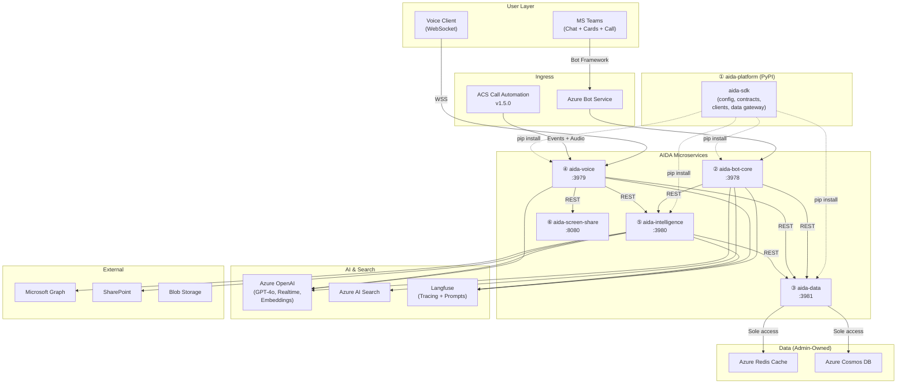

**ASCII Diagram — System Overview**

```
┌──────────────────────────────────────────────────────────────────────────────────────┐
│                              USER LAYER                                              │
│   ┌──────────────────────┐       ┌──────────────────────┐                           │
│   │  MS Teams             │       │  Voice Client         │                           │
│   │  (Chat + Cards + Call)│       │  (WebSocket)          │                           │
│   └──────────┬────────────┘       └──────────┬────────────┘                           │
└──────────────┼───────────────────────────────┼────────────────────────────────────────┘
               │ Bot Framework                  │ WSS
┌──────────────┼───────────────────────────────┼────────────────────────────────────────┐
│  INGRESS     │                                │                                       │
│  ┌───────────▼──────────┐    ┌────────────────▼─────────┐                            │
│  │ Azure Bot Service     │    │ ACS Call Automation v1.5  │                            │
│  └───────────┬──────────┘    └────────────────┬─────────┘                            │
└──────────────┼────────────────────────────────┼───────────────────────────────────────┘
               │                                │ Events + Audio
┌──────────────┼────────────────────────────────┼───────────────────────────────────────┐
│  AIDA MICROSERVICES                                                                   │
│  ┌───────────▼──────────┐  ┌──────────────────▼──────┐  ┌─────────────────────────┐  │
│  │ ② aida-bot-core      │  │ ④ aida-voice             │  │ ⑤ aida-intelligence     │  │
│  │    :3978              │  │    :3979                  │  │    :3980                │  │
│  └──┬───────┬───────────┘  └──┬──────┬───────────────┘  └──┬──────────────────────┘  │
│     │ REST  │ REST            │ REST │ REST                │ REST                     │
│  ┌──▼───────▼───────────────┐ │     ┌▼──────────────────┐  │                          │
│  │ ③ aida-data       :3981  │◄┘     │⑥ aida-screen-share│  │                          │
│  │   (Admin-Owned)          │◄──────┤   :8080           │  │                          │
│  └────┬─────────┬───────────┘       └───────────────────┘  │                          │
│       │         │ Sole access                               │                          │
└───────┼─────────┼───────────────────────────────────────────┼──────────────────────────┘
        │         │                                           │
┌───────▼─────────▼──────┐  ┌─────────────────────────────────▼────────────────────────┐
│  DATA (Admin-Owned)     │  │  AI & SEARCH + EXTERNAL                                  │
│  ┌──────────────────┐   │  │  ┌─────────────────┐ ┌────────────┐ ┌───────────────┐   │
│  │ Azure Redis Cache │   │  │  │ Azure OpenAI     │ │ AI Search  │ │ Langfuse      │   │
│  │ Azure Cosmos DB   │   │  │  │ (GPT-4o,Realtime│ │            │ │ (Tracing+     │   │
│  └──────────────────┘   │  │  │  Embeddings)     │ │            │ │  Prompts)     │   │
│                          │  │  └─────────────────┘ └────────────┘ └───────────────┘   │
└──────────────────────────┘  │  ┌─────────────────┐ ┌────────────┐ ┌───────────────┐   │
    ① aida-platform (PyPI)     │  │ Microsoft Graph  │ │ SharePoint │ │ Blob Storage  │   │
    ┌──────────────────────┐   │  └─────────────────┘ └────────────┘ └───────────────┘   │
    │ aida-sdk             │   └────────────────────────────────────────────────────────┘
    │ (config, contracts,  │
    │  clients, data gw)   │   pip install ──> all Python services
    └──────────────────────┘
```

### Connection Summary

| Source | Target | Protocol | Purpose |
|--------|--------|----------|---------|
| MS Teams | aida-bot-core | HTTPS (Bot Framework) | Chat messages, card submits |
| Voice Client | aida-voice | WSS /voice-v2 | Bidirectional audio |
| ACS | aida-voice | HTTPS + WSS | Call events + meeting audio |
| Graph | aida-voice | HTTPS webhook | Incoming call notification |
| aida-bot-core | aida-intelligence | REST API | Action detection, email, meetings, PPT |
| aida-bot-core | aida-data | REST API | Conversation history, session state |
| aida-voice | aida-intelligence | REST API | Post-meeting processing |
| aida-voice | aida-screen-share | REST API | Slide navigation, presentation |
| aida-voice | aida-data | REST API | Transcript, meeting state |
| aida-intelligence | aida-data | REST API | Meeting notes, contacts, action state |
| aida-data | Redis | TCP :6380 TLS | Session cache, pub/sub |
| aida-data | Cosmos DB | HTTPS | Document storage |
| All Python services | Langfuse | HTTPS | LLM tracing, prompt fetch |

---

## 3. High-Level Architecture

AIDA follows a **layered architecture** with clear separation of concerns, now distributed across 6 repositories.

```mermaid
graph TB
    subgraph Presentation["LAYER 1: PRESENTATION (Protocol Adapters)"]
        BotFW["Bot Framework<br/>(Teams Chat)"]
        WSS["WebSocket<br/>(Voice)"]
        Webhooks["Webhooks<br/>(Email, Calling, ACS)"]
        MeetingAPI["Meeting REST API"]
        AudioWSS["Meeting Audio<br/>(WSS)"]
    end

    subgraph Handlers["LAYER 2: HANDLERS (Command Routing, Card Rendering)"]
        ChatH["Chat Handler"]
        ActionH["Action Handler"]
        NotesH["Notes Handler"]
        PPTH["PPT Handler"]
        EmailH["Email Handler"]
        VoiceGW["Voice Gateway"]
        MtgJoin["Meeting Join Mgr"]
        MtgAudio["Meeting Audio Worker"]
    end

    subgraph Orchestration["LAYER 3: ORCHESTRATION (Business Logic, AI Pipelines)"]
        RAG["RAG Pipeline"]
        ActionOrch["Action Orchestrator"]
        MtgSumm["Meeting Summarizer"]
        PPTGen["PPT Generator"]
        EmailClass["Email Classifier"]
        PeopleRes["People Resolver"]
        MtgIntel["Meeting Intelligence"]
        PostMtg["Post-Meeting Processor"]
        DocIntel["Document Intelligence"]
        Skills["AIDA Skills Registry"]
    end

    subgraph ServiceLayer["LAYER 4: SERVICE (External APIs, Data Access)"]
        OpenAISvc["OpenAI Client"]
        SearchSvc["Search Client"]
        GraphSvc["Graph Client"]
        AcsSvc["ACS Client"]
        RealtimeSvc["Realtime Client"]
        LangfuseSvc["Langfuse Client"]
        DataGWSvc["Data Gateway Client"]
        WebSearchSvc["Web Search Client"]
        TelemetrySvc["Telemetry Client"]
    end

    subgraph DataGateway["LAYER 5: DATA GATEWAY (Admin-Owned)"]
        RedisStore["Redis Store"]
        CosmosStore["Cosmos Store"]
        PubSub["Event Pub/Sub"]
        Migrations["Schema Migrations"]
    end

    Presentation --> Handlers
    Handlers --> Orchestration
    Orchestration --> ServiceLayer
    ServiceLayer --> DataGateway
```

**ASCII Diagram — Layered Architecture**

```
┌─────────────────────────────────────────────────────────────────────────┐
│ LAYER 1: PRESENTATION (Protocol Adapters)                               │
│  Bot Framework │ WebSocket │ Webhooks │ Meeting REST │ Meeting Audio WSS│
└───────────────────────────────┬─────────────────────────────────────────┘
                                │
┌───────────────────────────────▼─────────────────────────────────────────┐
│ LAYER 2: HANDLERS (Command Routing, Card Rendering)                     │
│  Chat Handler │ Action Handler │ Notes Handler │ PPT Handler            │
│  Email Handler│ Voice Gateway  │ Meeting Join  │ Meeting Audio Worker   │
└───────────────────────────────┬─────────────────────────────────────────┘
                                │
┌───────────────────────────────▼─────────────────────────────────────────┐
│ LAYER 3: ORCHESTRATION (Business Logic, AI Pipelines)                   │
│  RAG Pipeline   │ Action Orchestrator │ Meeting Summarizer │ PPT Gen    │
│  Email Classify │ People Resolver     │ Meeting Intel      │ Post-Mtg   │
│  Doc Intelligence│ AIDA Skills Registry                                 │
└───────────────────────────────┬─────────────────────────────────────────┘
                                │
┌───────────────────────────────▼─────────────────────────────────────────┐
│ LAYER 4: SERVICE (External API Clients — aida-platform SDK)             │
│  OpenAI │ Search │ Graph │ ACS │ Realtime │ Langfuse │ Data GW │ Telem │
└───────────────────────────────┬─────────────────────────────────────────┘
                                │
┌───────────────────────────────▼─────────────────────────────────────────┐
│ LAYER 5: DATA GATEWAY (aida-data — Admin-Owned)                         │
│  Redis Store │ Cosmos Store │ Event Pub/Sub │ Schema Migrations          │
└─────────────────────────────────────────────────────────────────────────┘
```

### Layer Responsibilities (Revised for Microservices)

| Layer | Responsibility | Key Principle | Repo |
|-------|---------------|---------------|------|
| **Presentation** | Protocol handling (HTTP, WebSocket, Bot Framework, ACS events) | Thin — delegates immediately to handlers | aida-bot-core, aida-voice |
| **Handler** | Command routing, Adaptive Card rendering, call lifecycle, audio bridging | Stateless — reads/writes state via data gateway | aida-bot-core, aida-voice |
| **Orchestration** | Business logic, AI pipelines, multi-step workflows, meeting analysis | Core intelligence — owns state machines and pipelines | aida-intelligence |
| **Service** | External API communication, LLM tracing via Langfuse | Shared SDK clients — singleton, lazy init, retry-ready | aida-platform (SDK) |
| **Data Gateway** | Redis + Cosmos access, schema governance, migrations, pub/sub | Single owner of data stores — REST API surface | aida-data |

---

## 4. Logical Architecture

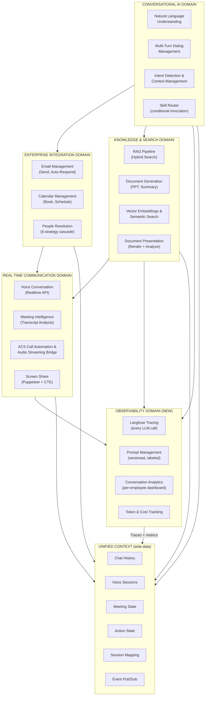

**ASCII Diagram — Logical Architecture**

```
┌─────────────────────────────────┐   ┌─────────────────────────────────┐
│  CONVERSATIONAL AI DOMAIN       │   │  ENTERPRISE INTEGRATION DOMAIN  │
│  ┌───────────┐ ┌──────────────┐ │   │  ┌────────────┐ ┌────────────┐ │
│  │NLU        │ │Multi-Turn    │ │   │  │Email Mgmt  │ │Calendar    │ │
│  │           │ │Dialog Mgmt   │ │──>│  │(Send,Auto) │ │(Book,Sched)│ │
│  │Intent Det │ │Skill Router  │ │   │  │People Res. │ │            │ │
│  └───────────┘ └──────────────┘ │   │  └────────────┘ └────────────┘ │
└────────┬────────────────────────┘   └──────────────┬──────────────────┘
         │                                            │
         ▼                                            ▼
┌─────────────────────────────────┐   ┌─────────────────────────────────┐
│  KNOWLEDGE & SEARCH DOMAIN      │   │  REAL-TIME COMMUNICATION DOMAIN │
│  ┌───────────┐ ┌──────────────┐ │   │  ┌────────────┐ ┌────────────┐ │
│  │RAG Pipeline│ │Doc Generation│ │──>│  │Voice Conv  │ │Meeting     │ │
│  │(Hybrid)   │ │(PPT, Summary)│ │   │  │(Realtime)  │ │Intelligence│ │
│  │Vector     │ │Doc Presenter │ │   │  │ACS Bridge  │ │Screen Share│ │
│  └───────────┘ └──────────────┘ │   │  └────────────┘ └────────────┘ │
└────────┬────────────────────────┘   └──────────────┬──────────────────┘
         │                                            │
         ▼                                            ▼
┌─────────────────────────────────┐   ┌─────────────────────────────────┐
│  OBSERVABILITY DOMAIN (NEW)     │   │  UNIFIED CONTEXT (aida-data)    │
│  ┌───────────┐ ┌──────────────┐ │   │  ┌────────────┐ ┌────────────┐ │
│  │Langfuse   │ │Prompt Mgmt   │ │   │  │Chat History│ │Voice Sess  │ │
│  │Tracing    │ │(Versioned)   │ │   │  │Meeting St. │ │Action St.  │ │
│  │Conv Analyt│ │Cost Tracking │ │   │  │Session Map │ │Pub/Sub     │ │
│  └───────────┘ └──────────────┘ │   │  └────────────┘ └────────────┘ │
└─────────────────────────────────┘   └─────────────────────────────────┘
         ▲           All domains feed traces + metrics + state           ▲
         └──────────────────────────────────────────────────────────────┘
```

---

## 5. Physical Architecture

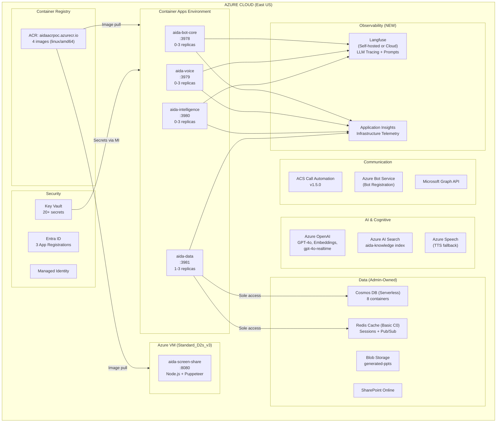

**ASCII Diagram — Physical Architecture**

```
╔══════════════════════════════════════════════════════════════════════════════════════╗
║  AZURE CLOUD (East US)                                                              ║
║                                                                                      ║
║  ┌── Container Apps Environment ──────────────────────────────────────────────────┐  ║
║  │  ┌──────────────────┐ ┌──────────────────┐ ┌──────────────────┐ ┌───────────┐ │  ║
║  │  │ aida-bot-core    │ │ aida-voice       │ │ aida-intelligence│ │ aida-data │ │  ║
║  │  │ :3978  (0-3)     │ │ :3979  (0-3)     │ │ :3980  (0-3)     │ │ :3981(1-3)│ │  ║
║  │  └──────────────────┘ └──────────────────┘ └──────────────────┘ └─────┬─────┘ │  ║
║  └───────────────────────────────────────────────────────────────────────┼────────┘  ║
║                                                                          │           ║
║  ┌── Azure VM (D2s_v3) ────┐  ┌── ACR ─────────────────┐              │           ║
║  │ aida-screen-share :8080  │  │ aidaacrpoc.azurecr.io   │              │ Sole      ║
║  │ Node.js + Puppeteer      │  │ 5 images (linux/amd64)  │              │ Access    ║
║  └──────────────────────────┘  └─────────────────────────┘              │           ║
║                                                                          ▼           ║
║  ┌── AI & Cognitive ────────────────┐  ┌── Data (Admin-Owned) ─────────────────┐   ║
║  │ Azure OpenAI (GPT-4o, Realtime)  │  │ Cosmos DB (Serverless, 8 containers)  │   ║
║  │ Azure AI Search (aida-knowledge) │  │ Redis Cache (Basic C0)                │   ║
║  │ Azure Speech (TTS fallback)      │  │ Blob Storage (generated-ppts)         │   ║
║  └──────────────────────────────────┘  │ SharePoint Online                     │   ║
║                                         └──────────────────────────────────────┘   ║
║  ┌── Communication ────────────────────┐  ┌── Security ────────────────────────┐   ║
║  │ ACS Call Automation v1.5.0          │  │ Key Vault (20+ secrets)            │   ║
║  │ Azure Bot Service                   │  │ Entra ID (3 App Registrations)     │   ║
║  │ Microsoft Graph API                 │  │ Managed Identity                   │   ║
║  └─────────────────────────────────────┘  └────────────────────────────────────┘   ║
║                                                                                      ║
║  ┌── Observability ────────────────────────────────────────────────────────────────┐ ║
║  │  Langfuse (Self-hosted/Cloud — LLM Tracing + Prompts)                          │ ║
║  │  Application Insights (Infrastructure Telemetry)                                │ ║
║  └─────────────────────────────────────────────────────────────────────────────────┘ ║
╚══════════════════════════════════════════════════════════════════════════════════════╝
```

### Azure Resources Summary

| Resource | SKU/Tier | Purpose | Owner |
|----------|---------|---------|-------|
| Azure Container Apps (x4) | Consumption | Bot-core, Voice, Intelligence, Data Gateway | Tech Lead / Devs |
| Azure VM (x1) | Standard_D2s_v3 | Screen Share Service (Puppeteer + Xvfb) | Dev C |
| Azure Container Registry | Basic | Docker image storage | Tech Lead |
| Azure OpenAI | Standard | GPT-4o, embeddings, Realtime API | Shared |
| Azure AI Search | Basic | Knowledge base hybrid search | Shared |
| Azure Cosmos DB | Serverless | Document storage, meeting intelligence, audit | **Admin** |
| Azure Redis Cache | Basic C0 | Session, conversation, meeting state cache | **Admin** |
| Azure Blob Storage | Standard LRS | Generated presentations | Shared |
| Azure Key Vault | Standard | Secret management (20+ secrets) | Tech Lead |
| Azure Bot Service | Free | Teams bot registration + calling | Tech Lead |
| SharePoint Online | — | Meeting notes (.docx) + presentation storage | Shared |
| Application Insights | — | Infrastructure monitoring & telemetry | Tech Lead |
| **Langfuse** | **Self-hosted / Cloud** | **LLM tracing, prompt management, evaluations** | **Tech Lead** |

---

## 6. Layered Architecture

```
+=========================================================================================+
|                    LAYERED ARCHITECTURE (Modular — 6 Repos)                             |
+=========================================================================================+
|                                                                                         |
|  LAYER 1: PRESENTATION (Ingress & Protocol Adapters)                                   |
|  ┌─ aida-bot-core ─────────────┐  ┌─ aida-voice ─────────────────────────┐            |
|  │  POST /api/messages          │  │  WSS /voice-v2 (Realtime voice)      │            |
|  │  POST /webhooks/mail         │  │  WSS /meeting-audio (ACS bridge)     │            |
|  │  GET  /health                │  │  POST /api/acs/events                │            |
|  └──────────────────────────────┘  │  POST /api/calling                   │            |
|                                     └──────────────────────────────────────┘            |
|                                                                                         |
|  LAYER 2: HANDLER (Command Routing & UI Rendering)                                     |
|  ┌─ aida-bot-core ─────────────┐  ┌─ aida-voice ─────────────────────────┐            |
|  │  chat_handler, action_handler│  │  voice_gateway, meeting_audio_worker │            |
|  │  notes_handler, ppt_handler  │  │  meeting_state, meeting_wake_word    │            |
|  │  email_handler, help_handler │  │  calling_webhook, acs_webhook        │            |
|  │  bot.py (AidaBot router)     │  │  voice_tools, voice_state            │            |
|  └──────────────────────────────┘  └──────────────────────────────────────┘            |
|                                                                                         |
|  LAYER 3: ORCHESTRATION (Business Logic & AI Pipelines)                                |
|  ┌─ aida-bot-core ─┐  ┌─ aida-intelligence ──────────────────────────────┐            |
|  │  rag_pipeline    │  │  action_orchestrator, people_resolver            │            |
|  └──────────────────┘  │  email_classifier, email_responder              │            |
|                         │  meeting_intelligence, meeting_post_processor   │            |
|                         │  meeting_notes, meeting_summarizer             │            |
|                         │  document_intelligence, document_renderer       │            |
|                         │  ppt_generator, skills_registry                │            |
|                         └─────────────────────────────────────────────────┘            |
|                                                                                         |
|  LAYER 4: SERVICE (External API Clients — aida-platform SDK)                           |
|  ┌─ aida_sdk/clients ──────────────────────────────────────────────────┐               |
|  │  openai_client  search_client  graph_client  acs_client             │               |
|  │  realtime_client  langfuse_client  web_search_client                │               |
|  │  telemetry_client  speech_client                                     │               |
|  └──────────────────────────────────────────────────────────────────────┘               |
|  ┌─ aida_sdk/data_gateway ──────────────────────────────────────────────┐              |
|  │  conversation_manager (HTTP → aida-data)                             │              |
|  │  redis_ops, cosmos_ops (thin REST wrappers)                          │              |
|  └──────────────────────────────────────────────────────────────────────┘               |
|                                                                                         |
|  LAYER 5: DATA GATEWAY (aida-data — Admin-Owned)                                      |
|  ┌──────────────────────────────────────────────────────────────────────┐               |
|  │  FastAPI :3981                                                       │               |
|  │  redis_store.py  cosmos_store.py  pubsub.py  migrations/            │               |
|  │  schemas/  monitoring/  maintenance/                                  │               |
|  │  ───────────────────────────────────────────                         │               |
|  │  ONLY service with direct Redis + Cosmos access                      │               |
|  └──────────────────────────────────────────────────────────────────────┘               |
|                                                                                         |
+=========================================================================================+
```

---

## 7. Network Architecture

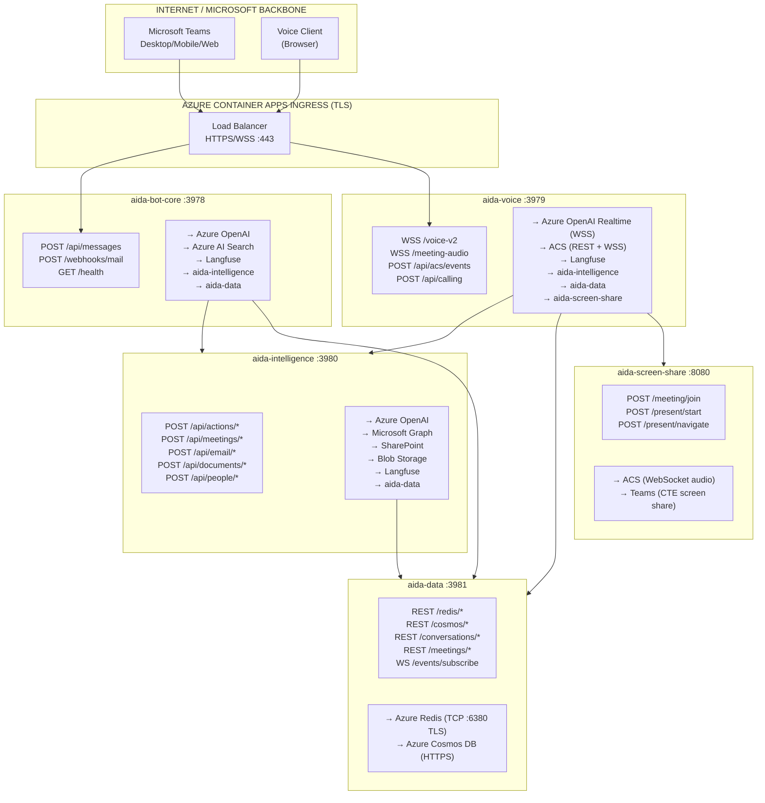

**ASCII Diagram — Network Architecture**

```
                    ┌─────────────────────────────────────────┐
                    │  INTERNET / MICROSOFT BACKBONE           │
                    │  MS Teams (Desktop/Mobile/Web)           │
                    │  Voice Client (Browser)                  │
                    └────────────────┬────────────────────────┘
                                     │ HTTPS/WSS :443
                    ┌────────────────▼────────────────────────┐
                    │  AZURE CONTAINER APPS INGRESS (TLS)      │
                    │  Load Balancer HTTPS/WSS :443             │
                    └──────┬─────────────────────┬────────────┘
                           │                     │
        ┌──────────────────▼──────┐  ┌───────────▼─────────────────────┐
        │  aida-bot-core :3978    │  │  aida-voice :3979                │
        │  IN:                    │  │  IN:                             │
        │    POST /api/messages   │  │    WSS /voice-v2                 │
        │    POST /webhooks/mail  │  │    WSS /meeting-audio            │
        │    GET /health          │  │    POST /api/acs/events          │
        │  OUT:                   │  │    POST /api/calling             │
        │    → Azure OpenAI       │  │  OUT:                            │
        │    → AI Search          │  │    → Azure OpenAI Realtime (WSS) │
        │    → Langfuse           │  │    → ACS (REST + WSS)            │
        │    → aida-intelligence  │  │    → Langfuse                    │
        │    → aida-data          │  │    → aida-intelligence           │
        └────┬──────────┬────────┘  │    → aida-data                   │
             │          │            │    → aida-screen-share           │
             │          │            └─────┬──────┬───────┬────────────┘
             │          │                  │      │       │
   ┌─────────▼──────────▼──────────────────▼──┐   │  ┌────▼──────────────────┐
   │  aida-intelligence :3980                  │   │  │ aida-screen-share    │
   │  IN:                                      │   │  │ :8080                │
   │    POST /api/actions/* /meetings/*        │   │  │ IN:                  │
   │    POST /api/email/* /documents/*         │   │  │   POST /meeting/join │
   │    POST /api/people/*                     │   │  │   POST /present/*    │
   │  OUT:                                     │   │  │ OUT:                 │
   │    → Azure OpenAI, Graph, SharePoint      │   │  │   → ACS (WSS audio) │
   │    → Blob Storage, Langfuse, aida-data    │   │  │   → Teams (CTE)     │
   └────────────────────┬──────────────────────┘   │  └──────────────────────┘
                        │                          │
             ┌──────────▼──────────────────────────▼──┐
             │  aida-data :3981                        │
             │  IN:                                    │
             │    REST /redis/* /cosmos/*               │
             │    /conversations/* /meetings/*          │
             │    WS /events/subscribe                  │
             │  OUT:                                    │
             │    → Azure Redis (TCP :6380 TLS)         │
             │    → Azure Cosmos DB (HTTPS)             │
             └─────────────────────────────────────────┘
```

### Protocol Summary

| Connection | Protocol | Port | Data Format | Auth |
|-----------|----------|------|-------------|------|
| Teams → aida-bot-core | HTTPS | 443 | Bot Framework Activity JSON | JWT Bearer |
| Voice Client → aida-voice | WSS | 443 | Audio PCM16 24kHz base64 | Session ID |
| ACS → aida-voice (events) | HTTPS | 443 | EventGrid CloudEvents JSON | Subscription validation |
| ACS → aida-voice (audio) | WSS | 443 | PCM16 24kHz mono base64 JSON | Connection ID |
| aida-bot-core → aida-intelligence | HTTP | 3980 | REST JSON | Internal (mTLS) |
| aida-bot-core → aida-data | HTTP | 3981 | REST JSON | Internal (mTLS) |
| aida-voice → aida-intelligence | HTTP | 3980 | REST JSON | Internal (mTLS) |
| aida-data → Redis | TCP/TLS | 6380 | Redis Protocol | Password |
| aida-data → Cosmos | HTTPS | 443 | SQL API JSON | Primary Key |
| All services → Langfuse | HTTPS | 443 | Langfuse SDK Protocol | API Key |
| All services → App Insights | HTTPS | 443 | OpenCensus | Connection String |

---

## 8. Component Architecture

### 8.1 aida-bot-core Components

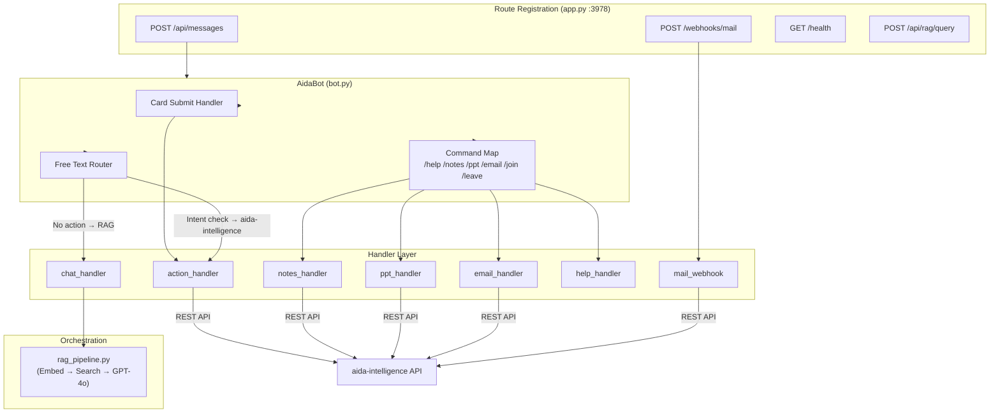

**ASCII Diagram — aida-bot-core Components**

```
┌── Route Registration (app.py :3978) ──────────────────────────────────┐
│  POST /api/messages  │  POST /webhooks/mail  │  GET /health           │
└──────────┬───────────────────────┬────────────────────────────────────┘
           │                       │
┌──────────▼───────────────────────┼────────────────────────────────────┐
│  AidaBot (bot.py)                │                                    │
│  ┌────────────┐ ┌──────────────┐ │  ┌──────────────┐                 │
│  │Card Submit  │ │Command Map   │ │  │Free Text     │                 │
│  │Handler     │ │/help /notes  │ │  │Router        │                 │
│  │            │ │/ppt /email   │ │  │              │                 │
│  └─────┬──────┘ └──┬───┬───┬──┘ │  └──┬────────┬──┘                 │
└────────┼────────────┼───┼───┼────┘     │        │                    │
         │            │   │   │          │        │                    │
┌── Handler Layer ────▼───▼───▼──────────▼────────▼────────────────────┐
│  action_handler │ notes_handler │ ppt_handler │ email_handler        │
│  chat_handler   │ help_handler  │ mail_webhook                       │
└──────┬──────────────┬───────────────┬────────────────────────────────┘
       │              │               │
       ▼              ▼               ▼
  rag_pipeline   aida-intelligence   aida-intelligence
  (local)        (REST API)          (REST API)
```

### 8.2 aida-voice Components

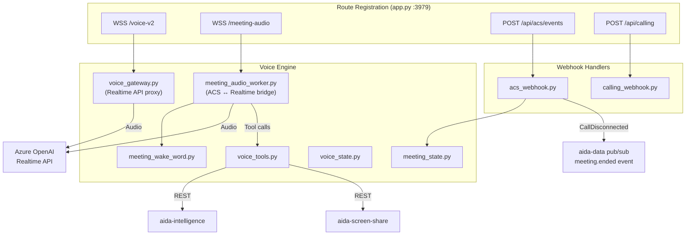

**ASCII Diagram — aida-voice Components**

```
┌── Route Registration (app.py :3979) ──────────────────────────────────┐
│  WSS /voice-v2 │ WSS /meeting-audio │ POST /api/acs/events │ /calling│
└──────┬──────────────────┬────────────────────┬──────────────┬────────┘
       │                  │                    │              │
       ▼                  ▼                    ▼              ▼
┌── Voice Engine ─────────────────────┐  ┌── Webhook Handlers ─────────┐
│  voice_gateway.py ──┐               │  │  acs_webhook.py             │
│  meeting_audio_     │ voice_tools   │  │    │                        │
│    worker.py  ──────┤   .py         │  │    ├─> meeting_state        │
│  meeting_wake_      │ voice_state   │  │    └─> aida-data pub/sub    │
│    word.py          │   .py         │  │        (meeting.ended)      │
│                     │ meeting_state │  │                              │
│                     │   .py         │  │  calling_webhook.py          │
└──┬──────────────────┴───┬───────────┘  └──────────────────────────────┘
   │                      │
   ▼                      ▼
Azure OpenAI          aida-intelligence
Realtime API          aida-screen-share
(WSS)                 (REST)
```

### 8.3 aida-intelligence Components

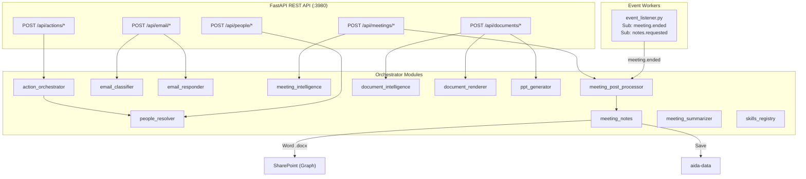

**ASCII Diagram — aida-intelligence Components**

```
┌── FastAPI REST API (:3980) ───────────────────────────────────────────┐
│  POST /api/actions/*  │ /meetings/*  │ /email/*  │ /documents/*       │
│  POST /api/people/*                                                   │
└──────┬────────────────────┬──────────────┬───────────┬────────────────┘
       │                    │              │           │
┌── Orchestrator Modules ───▼──────────────▼───────────▼────────────────┐
│  action_orchestrator ──> people_resolver                              │
│  email_classifier  │  email_responder                                 │
│  meeting_intelligence │ meeting_post_processor ──> meeting_notes      │
│  meeting_summarizer   │ document_intelligence  │ document_renderer    │
│  ppt_generator        │ skills_registry                               │
└──────────────────────────────┬────────────────────────────────────────┘
                               │
┌── Event Workers ─────────────▼────────────────────────────────────────┐
│  event_listener.py                                                    │
│    Sub: meeting.ended ──> meeting_post_processor ──> Word .docx       │
│    Sub: notes.requested                              ──> SharePoint   │
│                                                      ──> aida-data   │
└───────────────────────────────────────────────────────────────────────┘
```

### 8.4 aida-data Components

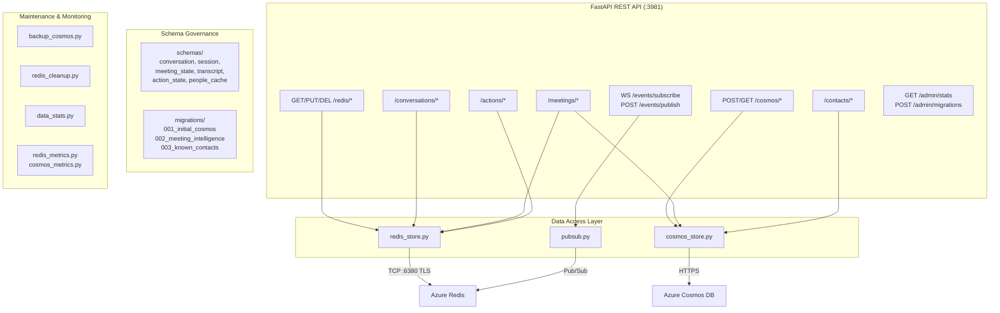

**ASCII Diagram — aida-data Components**

```
┌── FastAPI REST API (:3981) ───────────────────────────────────────────┐
│  GET/PUT/DEL /redis/*  │ POST/GET /cosmos/*  │ /conversations/*       │
│  /meetings/*  │ /contacts/*  │ /actions/*                             │
│  WS /events/subscribe  │  POST /events/publish                       │
│  GET /admin/stats  │  POST /admin/migrations                         │
└──┬────────────────┬───────────────────────────────────────────────────┘
   │                │
   ▼                ▼
┌── Data Access ────────────┐  ┌── Schema Governance ──────────────────┐
│  redis_store.py           │  │  schemas/                              │
│  cosmos_store.py          │  │    conversation, session, meeting_state│
│  pubsub.py                │  │    transcript, action_state, people    │
└──┬──────────┬─────────────┘  │  migrations/                          │
   │          │                │    001_initial_cosmos                  │
   │          │                │    002_meeting_intelligence            │
   ▼          ▼                │    003_known_contacts                  │
Azure      Azure               └───────────────────────────────────────┘
Redis      Cosmos DB
(TCP:6380  (HTTPS)             ┌── Maintenance & Monitoring ───────────┐
 TLS)                          │  backup_cosmos │ redis_cleanup         │
                               │  data_stats    │ redis_metrics         │
                               │                │ cosmos_metrics        │
                               └───────────────────────────────────────┘
```

### 8.5 Adaptive Cards (`bot_service/cards/`)

| Card Template | Purpose | Triggered By |
|---------------|---------|-------------|
| `chat_response.json` | RAG answer with source citations | chat_handler |
| `email_draft.json` | Auto-generated email draft for review | email_handler |
| `email_preview.json` | User-composed email preview (Send/Edit/Cancel) | action_handler |
| `meeting_preview.json` | Meeting booking preview (Book/Edit/Cancel) | action_handler |
| `meeting_summary.json` | Structured meeting summary (Graph transcript) | notes_handler |
| `meeting_intelligence.json` | Post-meeting intelligence summary (ACS session) | meeting_post_processor |
| `meeting_notes.json` | Post-meeting notes summary + SharePoint link | meeting_post_processor |
| `ppt_ready.json` | PowerPoint download link | ppt_handler |
| `slot_prompt.json` | Dynamic slot-collection card | action_handler |
| `help.json` | Feature overview and commands | help_handler |
| `voice_call_join.json` | Voice call invitation card | calling_webhook |

---

## 9. Data Flow — Sequence Diagrams

### 9.1 Chat Message — End to End (Modular)

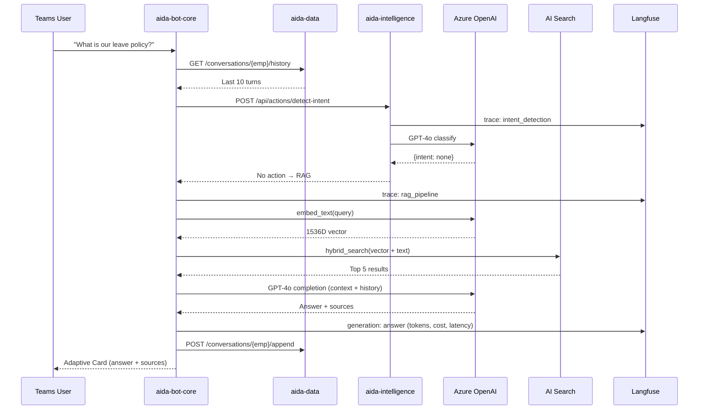

**ASCII Diagram — Chat Message E2E**

```
User            bot-core          aida-data         aida-intelligence     OpenAI       AI Search    Langfuse
 │                │                  │                     │                │              │           │
 │──"Leave policy?"─>                │                     │                │              │           │
 │                │──GET /conv/hist──>│                     │                │              │           │
 │                │<──Last 10 turns──│                     │                │              │           │
 │                │──POST detect-intent──────────────────>│                │              │           │
 │                │                  │                     │──trace────────────────────────────────────>│
 │                │                  │                     │──classify────>│              │           │
 │                │                  │                     │<─{intent:none}│              │           │
 │                │<──No action, RAG─────────────────────│                │              │           │
 │                │                  │                     │                │              │           │
 │                │──trace: rag_pipeline──────────────────────────────────────────────────────────────>│
 │                │──embed_text(q)──────────────────────────────────────>│              │           │
 │                │<──1536D vector───────────────────────────────────────│              │           │
 │                │──hybrid_search(vector+text)────────────────────────────────────────>│           │
 │                │<──Top 5 results────────────────────────────────────────────────────│           │
 │                │──GPT-4o (context+history)───────────────────────────>│              │           │
 │                │<──Answer + sources──────────────────────────────────│              │           │
 │                │──generation(tokens,cost)──────────────────────────────────────────────────────>│
 │                │──POST /conv/append──>│                     │                │              │    │
 │<──Adaptive Card│                  │                     │                │              │        │
```

### 9.2 Send Email — Slot-Filling Flow (Modular)

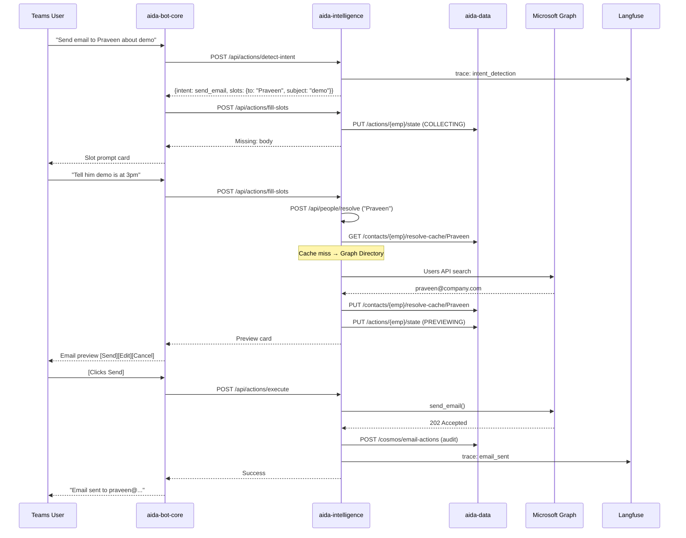

**ASCII Diagram — Send Email Slot-Filling**

```
User            bot-core        aida-intelligence      aida-data          Graph       Langfuse
 │                │                   │                    │                │            │
 │──"Email Praveen"─>                 │                    │                │            │
 │                │──detect-intent──>│                    │                │            │
 │                │                   │──trace─────────────────────────────────────────>│
 │                │<─{send_email}───│                    │                │            │
 │                │──fill-slots────>│                    │                │            │
 │                │                   │──PUT action state─>│                │            │
 │                │<─Missing: body──│  (COLLECTING)       │                │            │
 │<─Slot prompt card                  │                    │                │            │
 │                │                   │                    │                │            │
 │──"Demo at 3pm"──>                  │                    │                │            │
 │                │──fill-slots────>│                    │                │            │
 │                │                   │──resolve "Praveen"─>│                │            │
 │                │                   │    (cache miss)     │                │            │
 │                │                   │──────────────────────────Users API──>│            │
 │                │                   │<─────────────────────praveen@co.com─│            │
 │                │                   │──PUT cache──────────>│                │            │
 │                │                   │──PUT state(PREVIEW)─>│                │            │
 │                │<──Preview card──│                    │                │            │
 │<─Email preview [Send][Edit][Cancel]│                    │                │            │
 │                │                   │                    │                │            │
 │──[Send]────────>                   │                    │                │            │
 │                │──execute───────>│                    │                │            │
 │                │                   │──send_email────────────────────────>│            │
 │                │                   │<──202 Accepted─────────────────────│            │
 │                │                   │──POST audit────────>│                │            │
 │                │                   │──trace: email_sent──────────────────────────────>│
 │                │<──Success───────│                    │                │            │
 │<──"Email sent"─│                   │                    │                │            │
```

### 9.3 Voice Conversation Flow

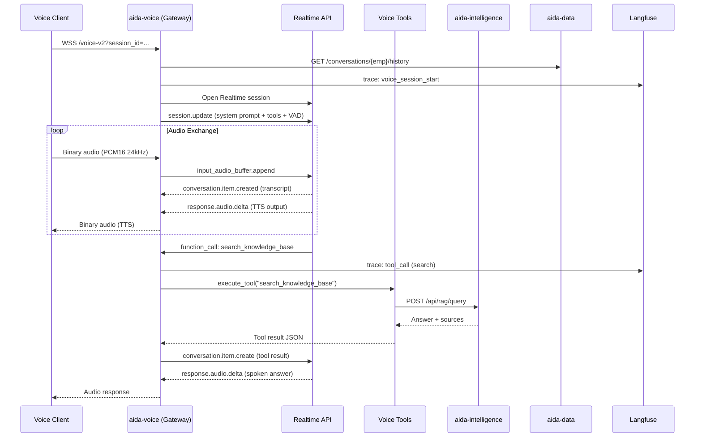

**ASCII Diagram — Voice Conversation Flow**

```
Voice Client       aida-voice (GW)      Realtime API       Voice Tools     aida-intelligence    Langfuse
 │                     │                     │                  │                 │               │
 │──WSS /voice-v2────>│                     │                  │                 │               │
 │                     │──GET /conv/hist───────────────────────────────────────>│               │
 │                     │──trace: voice_start───────────────────────────────────────────────────>│
 │                     │──Open Realtime────>│                  │                 │               │
 │                     │──session.update───>│                  │                 │               │
 │                     │  (system+tools+VAD)│                  │                 │               │
 │                     │                     │                  │                 │               │
 │  ┌── Audio Loop ────────────────────────────────────────────────────────────────────────────┐│
 │  │ Binary audio ──>│                     │                  │                 │              ││
 │  │                  │──audio.append────>│                  │                 │              ││
 │  │                  │<─audio.delta──────│                  │                 │              ││
 │  │<─Binary TTS─────│                     │                  │                 │              ││
 │  └──────────────────────────────────────────────────────────────────────────────────────────┘│
 │                     │                     │                  │                 │               │
 │                     │<─function_call:────│                  │                 │               │
 │                     │  search_knowledge   │                  │                 │               │
 │                     │──trace: tool_call──────────────────────────────────────────────────────>│
 │                     │──execute_tool───────────────────────>│                 │               │
 │                     │                     │                  │──POST /rag/q──>│               │
 │                     │                     │                  │<──Answer+src──│               │
 │                     │<─Tool result JSON─────────────────────│                 │               │
 │                     │──item.create──────>│                  │                 │               │
 │                     │<─audio.delta──────│                  │                 │               │
 │<──Audio response────│                     │                  │                 │               │
```

### 9.4 Meeting End → Post-Processing (Event-Driven)

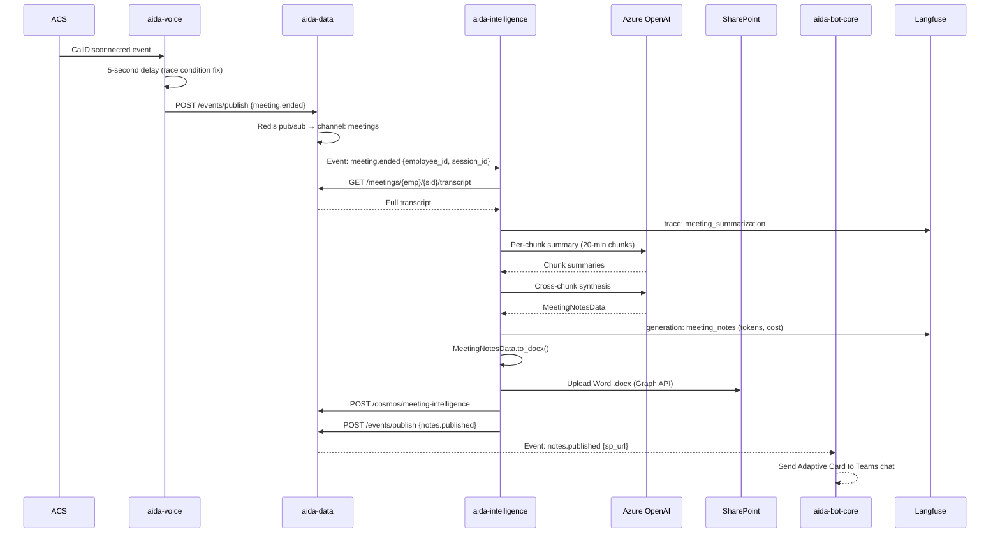

**ASCII Diagram — Meeting Post-Processing (Event-Driven)**

```
ACS         aida-voice        aida-data        aida-intelligence     OpenAI      SharePoint    bot-core    Langfuse
 │              │                 │                  │                  │             │            │           │
 │──CallDisconnected──>           │                  │                  │             │            │           │
 │              │  (5s delay)     │                  │                  │             │            │           │
 │              │──POST publish──>│                  │                  │             │            │           │
 │              │  {meeting.ended}│                  │                  │             │            │           │
 │              │                 │──Redis pub/sub──>│                  │             │            │           │
 │              │                 │                  │                  │             │            │           │
 │              │                 │<─GET transcript─│                  │             │            │           │
 │              │                 │──Full transcript─>                  │             │            │           │
 │              │                 │                  │──trace───────────────────────────────────────────────>│
 │              │                 │                  │──per-chunk GPT──>│             │            │           │
 │              │                 │                  │<─chunk summaries─│             │            │           │
 │              │                 │                  │──synthesis──────>│             │            │           │
 │              │                 │                  │<─MeetingNotes───│             │            │           │
 │              │                 │                  │──generation(cost)────────────────────────────────────>│
 │              │                 │                  │                  │             │            │           │
 │              │                 │                  │──.to_docx()      │             │            │           │
 │              │                 │                  │──Upload .docx──────────────────>│            │           │
 │              │                 │<─POST cosmos────│                  │             │            │           │
 │              │                 │<─POST publish───│                  │             │            │           │
 │              │                 │  {notes.published}                  │             │            │           │
 │              │                 │                  │                  │             │            │           │
 │              │                 │──event──────────────────────────────────────────────────────>│           │
 │              │                 │                  │                  │             │            │           │
 │              │                 │                  │                  │             │  Adaptive  │           │
 │              │                 │                  │                  │             │  Card sent │           │
```

---

## 10. Multi-Modal Conversation Model

AIDA maintains a **unified conversation context** per employee. Chat and voice share the same history, enabling seamless modality switching.

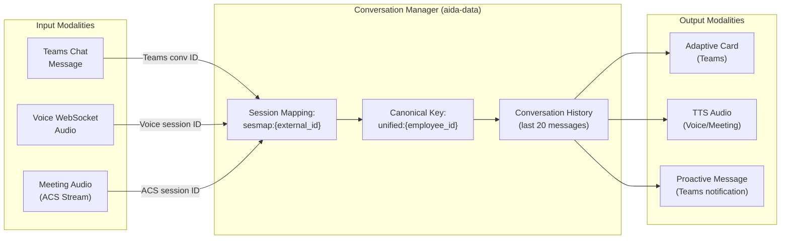

**ASCII Diagram — Multi-Modal Conversation Model**

```
┌── Input Modalities ──────────────────────────────────────────────────────┐
│                                                                          │
│  ┌─────────────┐  ┌─────────────────┐  ┌─────────────────────────────┐  │
│  │ Teams Chat   │  │ Voice WebSocket  │  │ Meeting Audio (ACS Stream) │  │
│  │ Message      │  │ Audio            │  │                             │  │
│  └──────┬───────┘  └───────┬──────────┘  └─────────────┬──────────────┘  │
└─────────┼──────────────────┼───────────────────────────┼─────────────────┘
          │ Teams conv ID     │ Voice session ID           │ ACS session ID
          │                   │                            │
┌─────────▼───────────────────▼────────────────────────────▼─────────────────┐
│  Conversation Manager (aida-data)                                          │
│  ┌────────────────────────────┐                                            │
│  │ Session Mapping:            │                                            │
│  │   sesmap:{external_id} ────────> Canonical Key: unified:{employee_id}   │
│  └────────────────────────────┘              │                              │
│                                    ┌─────────▼──────────┐                  │
│                                    │ Conversation History │                  │
│                                    │ (last 20 messages)   │                  │
│                                    └─────────┬──────────┘                  │
└──────────────────────────────────────────────┼─────────────────────────────┘
                                               │
┌──────────────────────────────────────────────▼─────────────────────────────┐
│  Output Modalities                                                         │
│  ┌───────────────┐  ┌──────────────────┐  ┌─────────────────────────────┐  │
│  │ Adaptive Card  │  │ TTS Audio         │  │ Proactive Message           │  │
│  │ (Teams)        │  │ (Voice/Meeting)   │  │ (Teams notification)        │  │
│  └───────────────┘  └──────────────────┘  └─────────────────────────────┘  │
└────────────────────────────────────────────────────────────────────────────┘
```

**Key principles:**
- All modalities converge on `unified:{employee_id}` canonical key
- Conversation history is stored via `aida-data` REST API
- Voice sessions have read access to chat history and vice versa
- Action state (slot-filling) persists across modality switches

---

## 11. RAG Pipeline

The RAG pipeline lives in **aida-bot-core** (the only orchestration logic that stays in the bot) for low-latency chat responses.

```
User Query → embed_text() → hybrid_search(vector+BM25, employee_id filter) → format_context(top-5)
→ load_history(aida-data) → GPT-4o(system_prompt + context + history, temp=0.2) → answer + sources
→ Langfuse trace (tokens, latency, cost) → Adaptive Card
```

| Component | Details |
|-----------|---------|
| Embedding model | text-embedding-3-small (1536D) |
| Search | Azure AI Search — hybrid vector + BM25, employee_id filter |
| LLM | GPT-4o (temp=0.2, max_tokens=1024) |
| Context | Top-5 documents + last 10 conversation turns |
| Tracing | Every RAG call → Langfuse trace with input/output/tokens/cost |
| Prompts | Fetched from **Langfuse prompt management** (versioned, labeled) |

---

## 12. Action Orchestrator — Email & Meeting Booking

Lives in **aida-intelligence** as a REST API.

**State Machine:**
```
COLLECTING → (all required slots filled) → PREVIEWING
PREVIEWING → (user confirms) → CONFIRMED → (Graph API call) → COMPLETED
PREVIEWING → (user edits) → COLLECTING
PREVIEWING → (user cancels) → CANCELLED
```

**REST API endpoints:**
- `POST /api/actions/detect-intent` — GPT-4o intent classification
- `POST /api/actions/fill-slots` — Extract and merge slot values
- `POST /api/actions/execute` — Confirm and execute via Graph
- `GET /api/actions/{employee_id}/state` — Current state

**Required slots:** `send_email` (to, subject, body) | `book_meeting` (title, attendees, date, start_time)

All intent detection and slot extraction prompts managed in **Langfuse** — enabling non-engineer prompt iteration.

---

## 13. Intelligent People Resolver

Lives in **aida-intelligence**: `POST /api/people/resolve`

**5-Strategy Cascade:**
1. Email regex pass-through
2. Redis resolution cache (1-hour TTL, via aida-data)
3. Cosmos DB known contacts (24-hour cache, via aida-data)
4. Graph Directory search (Users API)
5. Graph People API (relationship-ranked)
6. GenAI fuzzy match (GPT-4o disambiguation)

Self-learning: every resolution saved to Cosmos → future lookups instant.

---

## 14. Voice Architecture (Realtime API)

Lives in **aida-voice**. Two modes:

| Mode | Trigger | Behavior |
|------|---------|----------|
| **Direct voice** | WSS /voice-v2 | Client sends audio → Realtime API proxy |
| **Meeting audio** | ACS media stream | ACS audio → Manual VAD → Realtime API |

**Manual VAD pipeline:** ACS audio → echo cancellation (500ms post-speech) → energy threshold detection → silence watchdog (200ms poll, 0.7s commit) → Realtime API

**Barge-in:** StopAudio → ACS WSS + response.cancel + item.truncate → Realtime API

**Tools available in voice:** search_knowledge_base, send_email, book_meeting, get_meeting_notes, get_call_context, navigate_slide, web_search, generate_presentation

---

## 15. ACS Calling & Media Bot

Lives in **aida-voice**.

- 3 call modes: outbound to Teams user, outbound to ACS user, incoming (callback via Graph)
- ACS Call Automation SDK v1.5.0
- Media streaming configured at `create_call()` setup time (not mid-call)
- Audio format: PCM16 24kHz mono, base64 JSON — zero conversion needed between ACS and Realtime API

---

## 16. Teams Calling — Callback via ACS

Lives in **aida-voice** (`calling_webhook.py`).

Flow: User clicks "Call" in Teams → Graph sends commsNotification to `/api/calling` → aida-voice extracts caller identity → creates ACS outbound call back to caller → media streaming active → meeting_audio_worker bridges to Realtime API.

---

## 17. Meeting Intelligence

Lives in **aida-intelligence** (REST API) + **aida-voice** (live audio).

**Live (during meeting):** aida-voice captures speaker-attributed transcript → stores in aida-data periodically (every 5 entries)

**Post-meeting:** aida-intelligence listens for `meeting.ended` event → loads transcript from aida-data → chunked summarization → Word .docx → SharePoint → Adaptive Card

---

## 18. Email Auto-Response System

Lives in **aida-intelligence**.

**Pipeline:** Graph email webhook → `POST /api/email/classify` → GPT-4o structured classification → if confidence >= 0.85: auto-respond → if < 0.85: draft for review → audit log to Cosmos (via aida-data)

---

## 19. Meeting Summarization Pipeline

Two modes, both in **aida-intelligence**:

1. **Graph-based** (`/notes` command): Fetch VTT transcript from Graph → clean → GPT-4o summary
2. **ACS-based** (post-meeting): Live transcript from Redis → chunked (20-min chunks if > 30 min) → per-chunk GPT-4o → synthesis → MeetingNotesData → .docx → SharePoint

---

## 20. PowerPoint Generation

Lives in **aida-intelligence**: `POST /api/documents/generate-ppt`

Pipeline: User instruction → GPT-4o JSON (slide content) → python-pptx rendering → Blob Storage upload → SAS URL → Adaptive Card

---

## 21. Voice Copilot & Document Presenter

Split across **aida-voice** (navigation commands) + **aida-intelligence** (document rendering + analysis) + **aida-screen-share** (Teams screen share).

Flow: SharePoint search → download → LibreOffice render → PNG slides → GPT-4o Vision pre-analysis → screen-share-service REST → Puppeteer canvas → CTE screen share → voice navigation via tool calls

---

## 22. Screen Share Service

Lives in **aida-screen-share** (Node.js VM).

REST API:
- `POST /meeting/join` — Join meeting with audio bridge
- `POST /present/start` — Start slide presentation
- `POST /present/navigate` — Go to slide N
- `POST /present/stop` — Stop sharing
- `POST /meeting/leave` — Leave meeting

Components: Express :8080 + Puppeteer (headless Chrome) + CTE SDK + ScriptProcessorNode audio bridge (PCM16 24kHz WSS)

---

## 23. Database Schema & Data Model

**Admin-owned** — all access via aida-data REST API.

### Redis Key Registry

| Key Pattern | TTL | Writer | Readers |
|---|---|---|---|
| `conv:{canonical_id}` | 30 min | aida-bot-core, aida-voice | All |
| `session:{session_id}` | 30 min | aida-voice | aida-voice, aida-bot-core |
| `sesmap:{external_id}` | 1 hour | aida-bot-core, aida-voice | All |
| `voice-active:{employee_id}` | 4 hours | aida-voice | aida-bot-core |
| `action:{employee_id}` | 30 min | aida-intelligence | All |
| `people:{employee_id}:{name}` | 1 hour | aida-intelligence | aida-intelligence |
| `meeting:{employee_id}:{sid}` | 4 hours | aida-voice | aida-intelligence |
| `meeting-transcript:{sid}` | 4 hours | aida-voice | aida-intelligence |
| `teams-ref:{employee_id}` | 24 hours | aida-bot-core | aida-bot-core, aida-intelligence |
| `contacts:{employee_id}` | 24 hours | aida-intelligence | aida-intelligence |

### Cosmos DB Containers

| Container | Partition Key | Writer | Reader |
|-----------|--------------|--------|--------|
| `conversations` | employee_id | aida-bot-core | aida-bot-core |
| `meeting-notes` | employee_id | aida-intelligence | aida-intelligence, aida-voice |
| `meeting-intelligence` | employee_id | aida-intelligence | aida-intelligence, aida-voice |
| `email-responses` | employee_id | aida-intelligence | aida-intelligence |
| `email-actions` | employee_id | aida-intelligence | aida-intelligence |
| `meeting-actions` | employee_id | aida-intelligence | aida-intelligence |
| `known-contacts` | employee_id | aida-intelligence | aida-intelligence |
| `langfuse-prompts-cache` | prompt_name | aida-platform | All |

---

## 24. Azure Service Map

| Service | Connects To | Protocol | Purpose |
|---------|-------------|----------|---------|
| aida-bot-core | Azure OpenAI | HTTPS | RAG completion + embedding |
| aida-bot-core | Azure AI Search | HTTPS | Hybrid search |
| aida-bot-core | aida-intelligence | HTTP :3980 | Action detection, email, meetings |
| aida-bot-core | aida-data | HTTP :3981 | Conversation state |
| aida-bot-core | Langfuse | HTTPS | LLM tracing |
| aida-voice | Azure OpenAI Realtime | WSS | Bidirectional voice |
| aida-voice | ACS | HTTPS + WSS | Call automation + audio |
| aida-voice | aida-intelligence | HTTP :3980 | Tool execution |
| aida-voice | aida-data | HTTP :3981 | Transcript, meeting state |
| aida-voice | aida-screen-share | HTTP :8080 | Slide control |
| aida-voice | Langfuse | HTTPS | Voice session tracing |
| aida-intelligence | Azure OpenAI | HTTPS | Summarization, classification |
| aida-intelligence | Microsoft Graph | HTTPS | Mail, calendar, people, SharePoint |
| aida-intelligence | aida-data | HTTP :3981 | All data operations |
| aida-intelligence | Langfuse | HTTPS | Pipeline tracing |
| aida-data | Azure Redis | TCP :6380 | Cache + pub/sub |
| aida-data | Azure Cosmos DB | HTTPS | Document storage |
| aida-screen-share | ACS | WSS | Audio bridge |
| aida-screen-share | Teams | CTE SDK | Screen share |

---

## 25. API Surface & Endpoints

### aida-bot-core (:3978)

| Method | Path | Purpose |
|--------|------|---------|
| POST | `/api/messages` | Bot Framework messages (Teams) |
| GET | `/health` | Health check |
| POST | `/webhooks/mail` | Graph email webhook |
| POST | `/api/rag/query` | RAG query (for aida-voice tool calls) |

### aida-voice (:3979)

| Method | Path | Purpose |
|--------|------|---------|
| WSS | `/voice-v2` | Realtime voice proxy |
| WSS | `/meeting-audio` | ACS audio bridge |
| POST | `/api/acs/events` | ACS call lifecycle events |
| POST | `/api/calling` | Teams calling webhook |
| POST | `/api/meeting/join` | Trigger meeting join |
| POST | `/api/meeting/leave` | Leave meeting |
| GET | `/api/meeting/status` | Meeting status |
| GET | `/health` | Health check |

### aida-intelligence (:3980)

| Method | Path | Purpose |
|--------|------|---------|
| POST | `/api/actions/detect-intent` | Intent classification |
| POST | `/api/actions/fill-slots` | Slot extraction |
| POST | `/api/actions/execute` | Confirm + execute action |
| POST | `/api/meetings/summarize` | Graph transcript summary |
| POST | `/api/meetings/process-end` | Post-meeting pipeline |
| POST | `/api/email/classify` | Email classification |
| POST | `/api/email/respond` | Auto-response generation |
| POST | `/api/documents/render` | Document → PNG |
| POST | `/api/documents/analyze` | GPT-4o slide analysis |
| POST | `/api/documents/generate-ppt` | PowerPoint generation |
| POST | `/api/people/resolve` | Name → email resolution |
| GET | `/health` | Health check |

### aida-data (:3981)

| Method | Path | Purpose |
|--------|------|---------|
| GET/PUT/DEL | `/redis/session/{id}` | Session data |
| GET | `/conversations/{emp}/history` | Conversation history |
| POST | `/conversations/{emp}/append` | Add message |
| GET/PUT | `/meetings/{emp}/{sid}/state` | Meeting state |
| POST | `/meetings/{emp}/{sid}/transcript/append` | Transcript entry |
| GET | `/meetings/{emp}/{sid}/transcript` | Full transcript |
| GET/PUT | `/actions/{emp}/state` | Action state |
| GET/POST | `/contacts/{emp}` | Known contacts |
| POST | `/cosmos/{container}/items` | Create item |
| POST | `/cosmos/{container}/query` | Query items |
| POST | `/events/publish` | Publish event |
| WSS | `/events/subscribe/{channel}` | Subscribe to events |
| GET | `/admin/redis/stats` | Redis metrics |
| GET | `/admin/cosmos/stats` | Cosmos metrics |
| POST | `/admin/migrations/run` | Run migrations |
| GET | `/health` | Health check |

### aida-screen-share (:8080)

| Method | Path | Purpose |
|--------|------|---------|
| POST | `/meeting/join` | Join meeting with audio |
| POST | `/meeting/leave` | Leave meeting |
| POST | `/present/start` | Start slide presentation |
| POST | `/present/navigate` | Navigate to slide N |
| POST | `/present/stop` | Stop screen share |
| GET | `/health` | Health check |

---

## 26. Security & Authentication

### Authentication Flows

| Connection | Auth Method | Owner |
|-----------|-------------|-------|
| Teams → aida-bot-core | JWT Bearer (Bot Framework) | Bot App Registration |
| aida-* → Graph API | OAuth2 Client Credentials | Graph App Registration |
| aida-screen-share → Teams | ROPC (CTE service account) | CTE App Registration |
| aida-* → Azure OpenAI | API Key | Key Vault |
| aida-voice → ACS | Connection String | Key Vault |
| aida-data → Redis | Password (TLS) | Key Vault |
| aida-data → Cosmos | Primary Key | Key Vault |
| All services → Langfuse | API Key (public + secret) | Key Vault |
| Container Apps → Key Vault | Managed Identity | Entra ID |

### Security Controls

| Control | Implementation |
|---------|---------------|
| **Secret management** | Key Vault + Managed Identity (zero secrets in code) |
| **Data isolation** | All queries filtered by `employee_id` (enforced at aida-data) |
| **Internal service auth** | Container Apps internal networking (mTLS) |
| **Data gateway isolation** | Only aida-data has Redis/Cosmos network access |
| **Schema governance** | Admin approves all aida-data schema changes |
| **Prompt security** | Prompts versioned in Langfuse with production labels |
| **Session expiry** | Redis TTLs enforced by aida-data |
| **Webhook validation** | `client_state` secret, EventGrid subscription validation |

### 3 App Registrations

| Registration | ID | Purpose | Permissions |
|-------------|-----|---------|-------------|
| **Bot** | c211596e-... | Teams channel auth | Bot Framework |
| **Graph** | 4ec1b314-... | Mail, Calendar, People, SharePoint, Calling | Application-only (15+ permissions) |
| **CTE** | (separate) | Screen share Teams join | ROPC flow |

---

## 27. Deployment Architecture

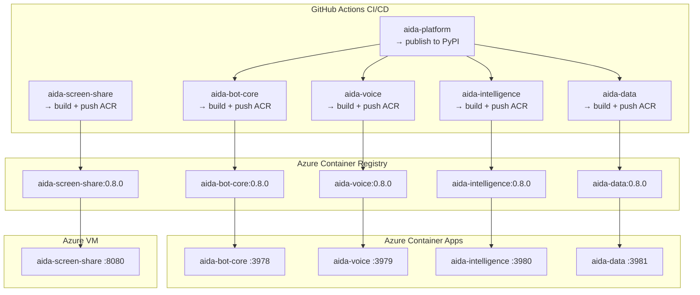

**ASCII Diagram — Deployment Architecture**

```
┌── GitHub Actions CI/CD ──────────────────────────────────────────────────────────┐
│                                                                                   │
│  ┌─────────────────┐                                                             │
│  │ aida-platform    │──> publish to PyPI                                          │
│  │ (SDK)            │                                                             │
│  └────────┬─────────┘                                                             │
│           │ triggers                                                              │
│  ┌────────▼─────────┐ ┌──────────────────┐ ┌──────────────────┐ ┌──────────────┐ │
│  │ aida-bot-core    │ │ aida-voice       │ │ aida-intelligence│ │ aida-data    │ │
│  │ build+push ACR   │ │ build+push ACR   │ │ build+push ACR   │ │ build+push   │ │
│  └────────┬─────────┘ └────────┬─────────┘ └────────┬─────────┘ └──────┬───────┘ │
│           │                    │                     │                  │          │
│  ┌────────▼────────────────────▼─────────────────────▼──────────────────▼───────┐ │
│  │ aida-screen-share ──> build+push ACR                                         │ │
│  └──────────────────────────────────────────────────────────────────────────────┘ │
└──────────────────────────────────────────────────────────────────────────────────┘
                           │
┌── Azure Container Registry ──────────────────────────────────────────────────────┐
│  aida-bot-core:0.8.0 │ aida-voice:0.8.0 │ aida-intelligence:0.8.0               │
│  aida-data:0.8.0     │ aida-screen-share:0.8.0                                  │
└────────────┬──────────────────────────────────────────────────────┬───────────────┘
             │ image pull                                           │ image pull
┌────────────▼────────────────────────────────────────┐  ┌─────────▼───────────────┐
│  Azure Container Apps                                │  │  Azure VM               │
│  ┌──────────────┐ ┌──────────────┐ ┌──────────────┐ │  │  aida-screen-share     │
│  │bot-core:3978 │ │voice:3979    │ │intel:3980    │ │  │  :8080                  │
│  └──────────────┘ └──────────────┘ └──────────────┘ │  └─────────────────────────┘
│  ┌──────────────┐                                    │
│  │data:3981     │                                    │
│  └──────────────┘                                    │
└──────────────────────────────────────────────────────┘
```

### Build Commands

```bash
# Build for Azure (linux/amd64) — required on Apple Silicon
docker build --platform linux/amd64 -t aidaacrpoc.azurecr.io/aida-bot-core:0.8.0 .
docker build --platform linux/amd64 -t aidaacrpoc.azurecr.io/aida-voice:0.8.0 .
docker build --platform linux/amd64 -t aidaacrpoc.azurecr.io/aida-intelligence:0.8.0 .
docker build --platform linux/amd64 -t aidaacrpoc.azurecr.io/aida-data:0.8.0 .
```

**Important:** Each repo has its own Dockerfile and CI/CD pipeline. Independent deployment — no monorepo build bottleneck.

---

## 28. Project Structure (6-Repo Modular)

```
① aida-platform/          (Tech Lead — Shared SDK)
├── aida_sdk/
│   ├── config.py
│   ├── contracts/ (conversation, meeting, action, document, email, events)
│   ├── clients/ (openai, graph, search, acs, realtime, langfuse, telemetry, web_search)
│   ├── data_gateway/ (conversation_manager, redis_ops, cosmos_ops)
│   └── utils/
├── tests/
└── pyproject.toml

② aida-bot-core/          (Tech Lead — Teams Bot + RAG)
├── bot_service/
│   ├── app.py, bot.py
│   ├── handlers/ (chat, action, notes, ppt, email, help)
│   ├── cards/ (10+ Adaptive Card templates)
│   └── webhooks/ (mail)
├── orchestrator/
│   └── rag_pipeline.py
├── Dockerfile
└── requirements.txt (depends: aida-sdk)

③ aida-data/              (Admin — Data Gateway)
├── data_service/
│   ├── app.py (FastAPI :3981)
│   ├── api/ (redis, cosmos, conversations, meetings, contacts, actions, events, health)
│   ├── store/ (redis_store, cosmos_store, pubsub)
│   ├── schemas/ (conversation, session, meeting_state, transcript, action_state, people_cache)
│   ├── migrations/
│   ├── maintenance/ (backup, cleanup, stats)
│   └── monitoring/ (redis_metrics, cosmos_metrics)
├── Dockerfile
└── requirements.txt (depends: aida-sdk)

④ aida-voice/             (Dev A — Voice + Calling)
├── voice_service/
│   ├── app.py (aiohttp :3979)
│   ├── voice_gateway.py, meeting_audio_worker.py
│   ├── voice_tools.py, voice_state.py, meeting_state.py
│   ├── meeting_wake_word.py
│   └── webhooks/ (acs, calling)
├── Dockerfile
└── requirements.txt (depends: aida-sdk)

⑤ aida-intelligence/      (Dev B — AI Pipelines)
├── intelligence_service/
│   ├── app.py (FastAPI :3980)
│   ├── api/ (actions, meetings, email, documents, people)
│   ├── orchestrator/ (action_orchestrator, people_resolver, email_classifier,
│   │                  email_responder, meeting_intelligence, meeting_post_processor,
│   │                  meeting_notes, meeting_summarizer, document_intelligence,
│   │                  document_renderer, ppt_generator, skills_registry)
│   ├── prompts/ (managed in Langfuse, local fallback .txt files)
│   └── workers/ (event_listener)
├── Dockerfile (includes LibreOffice)
└── requirements.txt (depends: aida-sdk)

⑥ aida-screen-share/      (Dev C — Presenter Service)
├── src/
│   ├── index.js (Express :8080)
│   ├── presenter.js, presenter.html
│   ├── audio-bridge.html
│   ├── call-manager.js, cte-auth.js
│   └── acs-browser-entry.js
├── Dockerfile (Chromium + Xvfb + PulseAudio)
└── package.json
```

---

## 29. Configuration Reference

All configuration is defined in `aida_sdk/config.py` (aida-platform). Key Vault overlays secrets at runtime.

<details>
<summary>Click to expand full configuration reference</summary>

#### Azure Bot Service
| Variable | Required | Default |
|----------|----------|---------|
| `MICROSOFT_APP_ID` | Yes | — |
| `MICROSOFT_APP_PASSWORD` | Yes | — |

#### Azure OpenAI
| Variable | Required | Default |
|----------|----------|---------|
| `AZURE_OPENAI_ENDPOINT` | Yes | — |
| `AZURE_OPENAI_API_KEY` | Yes | — |
| `AZURE_OPENAI_CHAT_DEPLOYMENT` | No | `gpt-4o` |
| `AZURE_OPENAI_EMBEDDING_DEPLOYMENT` | No | `text-embedding-3-small` |
| `AZURE_OPENAI_API_VERSION` | No | `2024-10-21` |

#### Realtime API (Voice)
| Variable | Required | Default |
|----------|----------|---------|
| `AZURE_OPENAI_REALTIME_ENDPOINT` | For voice | — |
| `AZURE_OPENAI_REALTIME_API_KEY` | For voice | — |
| `AZURE_OPENAI_REALTIME_DEPLOYMENT` | No | `gpt-realtime` |
| `AZURE_OPENAI_REALTIME_API_VERSION` | No | `2025-04-01-preview` |
| `AIDA_VOICE` | No | `sage` |
| `AIDA_VAD_THRESHOLD` | No | `0.4` |
| `AIDA_SILENCE_DURATION_MS` | No | `300` |

#### Langfuse (NEW)
| Variable | Required | Default |
|----------|----------|---------|
| `LANGFUSE_PUBLIC_KEY` | Yes | — |
| `LANGFUSE_SECRET_KEY` | Yes | — |
| `LANGFUSE_BASE_URL` | No | `https://cloud.langfuse.com` |
| `LANGFUSE_SAMPLE_RATE` | No | `1.0` |
| `LANGFUSE_ENABLED` | No | `true` |

#### Data Gateway
| Variable | Required | Default |
|----------|----------|---------|
| `AIDA_DATA_URL` | Yes | `http://aida-data:3981` |

#### Inter-Service URLs
| Variable | Required | Default |
|----------|----------|---------|
| `AIDA_INTELLIGENCE_URL` | Yes | `http://aida-intelligence:3980` |
| `AIDA_VOICE_URL` | No | `http://aida-voice:3979` |
| `SCREEN_SHARE_SERVICE_URL` | For presentations | — |

#### Remaining (unchanged)
Azure AI Search, Cosmos DB, Redis, Blob Storage, Microsoft Graph, SharePoint, ACS, Speech, CTE, Employee Profile — all as in v0.7.4.

</details>

---

## 30. Testing Strategy

Each repo has its own test suite. The aida-platform SDK includes contract tests.

```
① aida-platform/tests/     — SDK unit tests, contract validation
② aida-bot-core/tests/     — Handler tests, RAG pipeline, card rendering
③ aida-data/tests/         — Store tests, migration tests, API tests
④ aida-voice/tests/        — Voice gateway, audio worker, tool execution
⑤ aida-intelligence/tests/ — Orchestrator tests, pipeline tests, API tests
⑥ aida-screen-share/tests/ — Presenter tests, API tests
```

| Tool | Purpose |
|------|---------|
| `pytest` | Python test runner |
| `pytest-asyncio` | Async test support |
| `pytest-cov` | Coverage measurement |
| `aioresponses` | Mock HTTP calls |
| `jest` | Node.js test runner (screen-share) |
| `httpx` | FastAPI test client |

**Integration testing:** docker-compose.dev.yml spins up all services + Redis + Cosmos emulator.

---

## 31. Version History

| Version | Date | Changes |
|---------|------|---------|
| **v0.1** | Jan 2026 | RAG chat, meeting notes, PPT generation |
| **v0.2** | Feb 2026 | Real-time voice via Azure OpenAI Realtime API |
| **v0.2.3** | Feb 2026 | Email auto-response, voice hold/resume, telemetry |
| **v0.3.0** | Feb 2026 | Send email & book meeting, Adaptive Cards, people resolver |
| **v0.4.0** | Feb 2026 | ACS calling, meeting intelligence, wake-word, post-meeting summaries |
| **v0.4.1** | Feb 2026 | Teams calling webhook (callback-via-ACS) |
| **v0.4.9h** | Feb 2026 | .NET Media Bridge (deprecated in v0.7.3) |
| **v0.5.6** | Feb 2026 | Voice call context, speaker tracking, web search |
| **v0.5.9** | Feb 2026 | Chunked meeting notes, MeetingNotesData, OneNote attempted (blocked) |
| **v0.6.0** | Feb 2026 | Word .docx to SharePoint (replaced OneNote) |
| **v0.7.0** | Feb 2026 | Document intelligence, voice-controlled presentations |
| **v0.7.3** | Feb 2026 | Screen share service, CTE audio bridge |
| **v0.7.4** | Feb 2026 | Manual VAD, silence watchdog, manual barge-in |
| **v0.7.5** | Mar 2026 | **Langfuse integration, prompt management, unified observability** |
| **v0.7.6** | Mar 2026 | **AIDA Skills Framework, modular capability packaging** |
| **v0.7.7** | Apr 2026 | **Modular microservices, aida-data gateway, event-driven architecture** |

---

## 32. Langfuse — LLM Observability & Prompt Management

### 32.1 Why Langfuse

AIDA makes 15+ distinct LLM calls per feature flow (intent detection, slot extraction, RAG, summarization, classification, people resolution). Without structured observability, debugging prompt regressions, tracking cost, and iterating on prompts requires code deployments. Langfuse solves this.

### 32.2 Integration Architecture

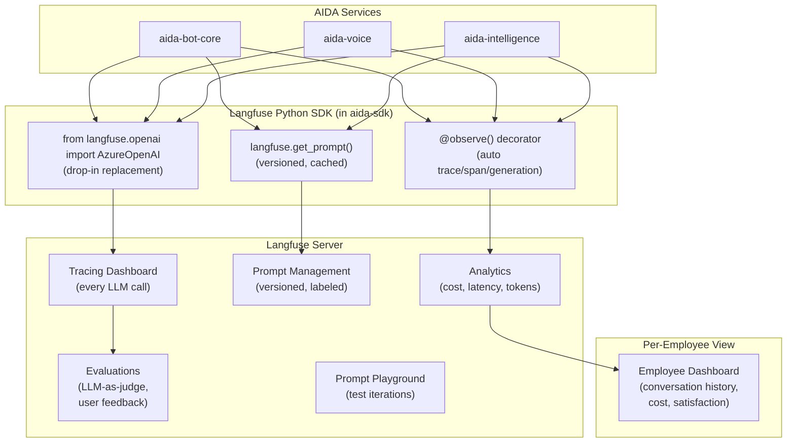

**ASCII Diagram — Langfuse Integration Architecture**

```
┌── AIDA Services ──────────────────────────────────────────────────────┐
│  aida-bot-core  │  aida-voice  │  aida-intelligence                   │
└──────┬──────────────────┬───────────────┬─────────────────────────────┘
       │                  │               │
       ▼                  ▼               ▼
┌── Langfuse Python SDK (in aida-sdk) ─────────────────────────────────┐
│  ┌──────────────────────────┐  ┌───────────────────┐  ┌───────────┐  │
│  │from langfuse.openai      │  │langfuse.get_prompt │  │@observe() │  │
│  │ import AzureOpenAI       │  │(versioned, cached) │  │decorator  │  │
│  │(drop-in replacement)     │  │                    │  │(auto trace│  │
│  └────────────┬─────────────┘  └─────────┬─────────┘  │ span/gen) │  │
└───────────────┼──────────────────────────┼─────────────┴───┬───────┘
                │                          │                  │
                ▼                          ▼                  ▼
┌── Langfuse Server ───────────────────────────────────────────────────┐
│  ┌─────────────┐ ┌────────────┐ ┌──────────┐ ┌───────────────────┐  │
│  │Tracing Dash │ │Prompt Mgmt │ │Analytics │ │Evaluations        │  │
│  │(every LLM)  │ │(versioned, │ │(cost,    │ │(LLM-as-judge,     │  │
│  │             │ │ labeled)   │ │ latency, │ │ user feedback)     │  │
│  │             │ │            │ │ tokens)  │ │                    │  │
│  └──────┬──────┘ └────────────┘ └─────┬────┘ └───────────────────┘  │
│         │                              │                             │
│         ▼                              ▼                             │
│  ┌──────────────────────────────────────────────┐                    │
│  │ Per-Employee Dashboard                        │                    │
│  │ (conversation history, cost, satisfaction)    │                    │
│  └──────────────────────────────────────────────┘                    │
└──────────────────────────────────────────────────────────────────────┘
```

### 32.3 Integration Pattern

**Drop-in OpenAI wrapper** — replace Azure OpenAI import:

```python
# Before (in aida_sdk/clients/openai_client.py)
from openai import AsyncAzureOpenAI

# After
from langfuse.openai import AsyncAzureOpenAI
```

This automatically traces every `chat.completions.create()` and `embeddings.create()` call with:
- Input prompt + output completion
- Token usage (input, output, total)
- Cost calculation (per model)
- Latency (time to first token, total)
- Model name and parameters

**Trace metadata** enriches every call:

```python
response = await client.chat.completions.create(
    model="gpt-4o",
    messages=messages,
    metadata={
        "langfuse_session_id": f"session:{employee_id}",
        "langfuse_user_id": employee_id,
        "langfuse_tags": ["rag", "chat"],
    },
)
```

### 32.4 Prompt Management

All 17+ GPT prompt templates migrate from `.txt` files to **Langfuse Prompt Management**:

| Prompt Name | Current File | Langfuse Label | Used By |
|-------------|-------------|----------------|---------|
| `chat_system` | chat_system.txt | production | aida-bot-core (RAG) |
| `intent_detect` | intent_detect.txt | production | aida-intelligence |
| `slot_fill_email` | slot_fill_email.txt | production | aida-intelligence |
| `slot_fill_meeting` | slot_fill_meeting.txt | production | aida-intelligence |
| `email_compose` | email_compose.txt | production | aida-intelligence |
| `email_classify` | email_classify.txt | production | aida-intelligence |
| `email_respond` | email_respond.txt | production | aida-intelligence |
| `meeting_summary` | meeting_summary.txt | production | aida-intelligence |
| `meeting_notes_chunk` | meeting_notes_chunk.txt | production | aida-intelligence |
| `meeting_notes_synthesis` | meeting_notes_synthesis.txt | production | aida-intelligence |
| `meeting_intelligence` | meeting_intelligence.txt | production | aida-intelligence |
| `ppt_content` | ppt_content.txt | production | aida-intelligence |
| `slide_analysis` | slide_analysis.txt | production | aida-intelligence |
| `voice_system` | (inline in voice_gateway.py) | production | aida-voice |
| `direct_call_system` | direct_call_system.txt | production | aida-voice |
| `wake_word_system` | wake_word_system.txt | production | aida-voice |
| `presenter_system` | presenter_system.txt | production | aida-voice |

**Runtime fetch with caching:**

```python
from langfuse import Langfuse

langfuse = Langfuse()
prompt = langfuse.get_prompt("chat_system", label="production", cache_ttl_seconds=300)
compiled = prompt.compile(employee_name="Praveen", job_title="Engineer", company="NCS")
```

**Benefits:**
- Non-engineers update prompts in Langfuse UI → instant deployment (no code change)
- A/B testing: create `staging` label, compare against `production`
- Version history: every prompt change tracked with author and timestamp
- Linked to traces: see which prompt version produced which responses
- Local `.txt` files kept as fallback if Langfuse is unreachable

### 32.5 Per-Employee Conversation Tracking

Every Langfuse trace is tagged with `employee_id` as the user identifier. This enables:

- **Employee dashboard:** All conversations, LLM calls, costs per employee
- **Session grouping:** Chat and voice sessions grouped by `session_id`
- **Quality monitoring:** Flag low-confidence responses, hallucinations
- **Cost allocation:** Token usage and cost breakdown per employee/department
- **Feedback loop:** User thumbs-up/down on Adaptive Cards → Langfuse score

---

## 33. AIDA Skills Framework (OpenAI Skills Integration)

### 33.1 Concept

Inspired by [OpenAI Skills in the API](https://developers.openai.com/cookbook/examples/skills_in_api/), AIDA packages its capabilities as **modular, versioned skill bundles** that are conditionally invoked by the LLM. Skills sit between system prompts (always-on) and tools (atomic functions) — they are multi-step procedures that the model activates only when needed.

### 33.2 Architecture

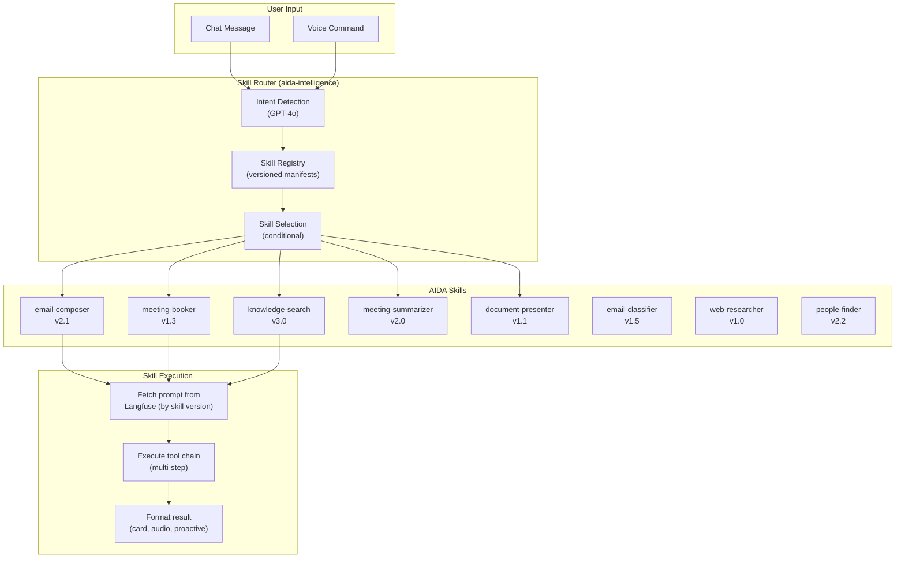

**ASCII Diagram — AIDA Skills Framework**

```
┌── User Input ────────────────┐
│  Chat Message │ Voice Command │
└──────┬────────────────┬──────┘
       │                │
       ▼                ▼
┌── Skill Router (aida-intelligence) ──────────────────────────────────┐
│  ┌──────────────┐  ┌───────────────┐  ┌──────────────────┐          │
│  │Intent Detect  │─>│Skill Registry  │─>│Skill Selection   │          │
│  │(GPT-4o)       │  │(versioned      │  │(conditional)     │          │
│  │               │  │ manifests)     │  │                  │          │
│  └──────────────┘  └───────────────┘  └────────┬─────────┘          │
└────────────────────────────────────────────────┼─────────────────────┘
                                                  │ selects best match
                                                  ▼
┌── AIDA Skills ───────────────────────────────────────────────────────┐
│  ┌──────────────┐ ┌──────────────┐ ┌──────────────┐ ┌────────────┐  │
│  │email-composer │ │meeting-booker│ │knowledge-    │ │meeting-    │  │
│  │v2.1           │ │v1.3          │ │search v3.0   │ │summarizer  │  │
│  └──────┬───────┘ └──────────────┘ └──────────────┘ │v2.0        │  │
│  ┌──────────────┐ ┌──────────────┐ ┌──────────────┐ └────────────┘  │
│  │doc-presenter  │ │email-        │ │web-researcher│ ┌────────────┐  │
│  │v1.1           │ │classifier    │ │v1.0          │ │people-     │  │
│  └──────────────┘ │v1.5          │ └──────────────┘ │finder v2.2 │  │
│                    └──────────────┘                   └────────────┘  │
└──────────────────────────┬───────────────────────────────────────────┘
                           │
                           ▼
┌── Skill Execution ───────────────────────────────────────────────────┐
│  Fetch prompt from Langfuse ──> Execute tool chain ──> Format result │
│  (by skill version)             (multi-step)            (card/audio) │
└──────────────────────────────────────────────────────────────────────┘
```

### 33.3 Skill Manifest (SKILL.md)

Each skill is a folder with a manifest, prompts, and optional scripts:

```
skills/
├── email-composer/
│   ├── SKILL.md              # Manifest (name, description, version, when-to-use)
│   ├── prompts/
│   │   ├── compose.txt       # Email drafting prompt
│   │   └── tone_adjust.txt   # Tone adjustment prompt
│   ├── tools.json            # Tool definitions this skill uses
│   └── config.yaml           # Skill-specific settings
│
├── meeting-summarizer/
│   ├── SKILL.md
│   ├── prompts/
│   │   ├── chunk.txt         # Per-chunk summarization
│   │   └── synthesize.txt    # Cross-chunk synthesis
│   └── tools.json
│
├── knowledge-search/
│   ├── SKILL.md
│   ├── prompts/
│   │   └── rag_system.txt    # RAG system prompt
│   └── config.yaml           # Search parameters (top_k, temp, etc.)
```

**Example SKILL.md:**

```yaml
---
name: email-composer
description: >
  Compose professional emails on behalf of the employee.
  Handles slot-filling (to, subject, body), people resolution,
  tone adjustment, and Graph API execution.
version: 2.1
---

# Email Composer Skill

## When to use
- User wants to send an email
- User wants to reply to an email
- User wants to draft an email for review

## When NOT to use
- User is asking about email status (use email-classifier)
- User is asking about inbox contents (use knowledge-search)

## Procedure
1. Detect email intent and extract initial slots
2. Resolve recipient names to email addresses
3. Generate professional email body with appropriate tone
4. Present preview card for confirmation
5. Execute via Microsoft Graph send_email()
```

### 33.4 Skill Registry

```python
class SkillRegistry:
    """Registry of available AIDA skills with version management."""

    skills: dict[str, SkillManifest]

    async def discover(self, user_intent: str, context: ConversationContext) -> SkillManifest | None:
        """Select the best skill for the user's intent."""

    async def execute(self, skill: SkillManifest, context: ConversationContext) -> SkillResult:
        """Execute a skill's procedure chain."""

    def get_version(self, skill_name: str, label: str = "production") -> SkillManifest:
        """Get a specific version of a skill (version pinning for production)."""
```

### 33.5 Azure OpenAI Skills API Readiness

When Azure OpenAI adds support for the OpenAI Skills API (`/v1/skills` endpoint), AIDA can natively upload skill packages:

```python
# Future: native Azure OpenAI Skills integration
response = await client.responses.create(
    model="gpt-4o",
    tools=[{
        "type": "shell",
        "environment": {
            "type": "container_auto",
            "skills": [
                {"type": "skill_reference", "skill_id": email_skill_id, "version": 2},
                {"type": "skill_reference", "skill_id": search_skill_id},
            ],
        },
    }],
    input=user_message,
)
```

Until then, AIDA implements the skill pattern at the application layer with:
- Skill manifests for discovery and routing
- Langfuse for prompt versioning (per-skill)
- Conditional invocation via intent detection
- Version pinning in production

---

## 34. OpenTelemetry & Unified Observability Architecture

**OpenTelemetry (OTel)** is the foundational telemetry layer for the entire AIDA platform. Every microservice instruments with the OTel Python SDK, and traces/metrics/logs are exported to **two backends** simultaneously — **Langfuse** (LLM-specific observability, prompts, cost) and **Azure Application Insights** (infrastructure, HTTP, dependencies). This dual-export architecture provides complete visibility from a single instrumentation layer.

### 34.1 Three-Layer Observability

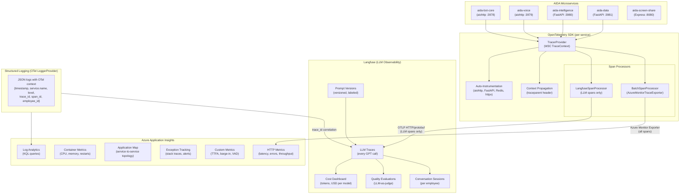

**ASCII Diagram — Three-Layer Observability (OpenTelemetry)**

```
┌── AIDA Microservices ──────────────────────────────────────────────────────┐
│  bot-core:3978 │ voice:3979 │ intelligence:3980 │ data:3981 │ screen:8080 │
└──────┬──────────────────┬──────────────────┬──────────────────┬────────────┘
       │                  │                  │                  │
       └──────────────────┴────────┬─────────┴──────────────────┘
                                   │
┌── OpenTelemetry SDK (per service) ───────────────────────────────────────────┐
│                                                                               │
│  ┌──────────────────┐  ┌──────────────────────────────┐  ┌────────────────┐  │
│  │ TracerProvider    │  │ Auto-Instrumentation         │  │ Context Prop.  │  │
│  │ (W3C TraceContext)│  │ (aiohttp, FastAPI, Redis,    │  │ (traceparent   │  │
│  │                   │  │  httpx, Azure SDK)           │  │  header)       │  │
│  └─────────┬─────────┘  └──────────────────────────────┘  └────────────────┘  │
│            │                                                                   │
│    ┌───────┴──────────────────────────────────┐                               │
│    │           Span Processors                 │                               │
│    │  ┌──────────────────┐ ┌────────────────┐  │                               │
│    │  │LangfuseSpan      │ │BatchSpanProc   │  │                               │
│    │  │Processor         │ │(AzureMonitor   │  │                               │
│    │  │(LLM spans only)  │ │TraceExporter)  │  │                               │
│    │  └────────┬─────────┘ └───────┬────────┘  │                               │
│    └───────────┼───────────────────┼───────────┘                               │
└────────────────┼───────────────────┼───────────────────────────────────────────┘
                 │                   │
    OTLP HTTP    │                   │  Azure Monitor
    (LLM only)   │                   │  Exporter (all)
                 ▼                   ▼
┌── Langfuse ──────────────────┐  ┌── Azure Application Insights ──────────────┐
│  ┌──────────┐ ┌────────────┐ │  │  ┌──────────┐ ┌────────────┐ ┌──────────┐ │
│  │LLM Traces│ │Prompt      │ │  │  │HTTP      │ │Container   │ │App Map   │ │
│  │          │ │Versions    │ │  │  │Metrics   │ │Metrics     │ │(topology)│ │
│  │Conv      │ │Cost Dash   │ │  │  │Exceptions│ │Custom      │ │Log       │ │
│  │Sessions  │ │Quality     │ │  │  │Tracking  │ │Metrics     │ │Analytics │ │
│  └──────────┘ └────────────┘ │  │  └──────────┘ └────────────┘ └──────────┘ │
└──────────────────────────────┘  └────────────────────────────────────────────┘

┌── Structured Logging (OTel LoggerProvider) ──────────────────────────────────┐
│  JSON logs: {timestamp, service.name, level, trace_id, span_id, employee_id} │
│                       │                                │                      │
│                       ▼                                ▼                      │
│              Log Analytics (KQL)               Langfuse Trace Annotations     │
└──────────────────────────────────────────────────────────────────────────────┘
```

### 34.2 OpenTelemetry SDK Setup

Each AIDA microservice initializes a shared `TracerProvider` with dual span processors during startup. The `aida-platform` SDK provides a centralized `setup_telemetry()` function:

```python
# aida_sdk/telemetry.py (in aida-platform repo)
from opentelemetry import trace
from opentelemetry.sdk.trace import TracerProvider
from opentelemetry.sdk.trace.export import BatchSpanProcessor
from opentelemetry.sdk.resources import Resource
from opentelemetry.instrumentation.aiohttp_server import AioHttpServerInstrumentor
from opentelemetry.instrumentation.aiohttp_client import AioHttpClientInstrumentor
from opentelemetry.instrumentation.httpx import HTTPXClientInstrumentor
from opentelemetry.instrumentation.redis import RedisInstrumentor
from opentelemetry.instrumentation.fastapi import FastAPIInstrumentor
from azure.monitor.opentelemetry.exporter import AzureMonitorTraceExporter
from langfuse.opentelemetry import LangfuseSpanProcessor

def setup_telemetry(
    service_name: str,
    az_connection_string: str | None = None,
    langfuse_enabled: bool = True,
    environment: str = "production",
):
    """Initialize OTel with dual-export to Azure Monitor + Langfuse."""
    resource = Resource.create({
        "service.name": service_name,
        "service.namespace": "aida",
        "deployment.environment": environment,
    })

    provider = TracerProvider(resource=resource)

    # Exporter 1: Azure Monitor (ALL spans — HTTP, Redis, dependencies)
    if az_connection_string:
        azure_exporter = AzureMonitorTraceExporter(
            connection_string=az_connection_string,
        )
        provider.add_span_processor(BatchSpanProcessor(azure_exporter))

    # Exporter 2: Langfuse (LLM spans only — filters out infra noise)
    if langfuse_enabled:
        provider.add_span_processor(
            LangfuseSpanProcessor(
                blocked_instrumentation_scopes=[
                    "opentelemetry.instrumentation.aiohttp_server",
                    "opentelemetry.instrumentation.aiohttp_client",
                    "opentelemetry.instrumentation.httpx",
                    "opentelemetry.instrumentation.redis",
                    "opentelemetry.instrumentation.fastapi",
                ]
            )
        )

    trace.set_tracer_provider(provider)

    # Auto-instrument libraries (framework-specific)
    AioHttpServerInstrumentor().instrument()   # aida-bot-core, aida-voice
    AioHttpClientInstrumentor().instrument()   # inter-service HTTP calls
    HTTPXClientInstrumentor().instrument()     # httpx async clients
    RedisInstrumentor().instrument()           # async Redis operations

    return provider


def shutdown_telemetry(provider: TracerProvider):
    """Flush and shut down all span processors."""
    provider.shutdown()
```

**Service startup example** (aida-bot-core):

```python
# bot_service/app.py
from aida_sdk.telemetry import setup_telemetry, shutdown_telemetry

provider = setup_telemetry(
    service_name="aida-bot-core",
    az_connection_string=settings.APPINSIGHTS_CONNECTION_STRING,
    langfuse_enabled=True,
)

# ... aiohttp app setup ...

async def on_shutdown(app):
    shutdown_telemetry(provider)
```

**FastAPI services** (aida-intelligence, aida-data) additionally instrument FastAPI:

```python
from opentelemetry.instrumentation.fastapi import FastAPIInstrumentor

app = FastAPI(title="aida-intelligence")
FastAPIInstrumentor.instrument_app(app)
```

### 34.3 W3C Trace Context Propagation

OpenTelemetry propagates **W3C TraceContext** (`traceparent` + `tracestate` headers) automatically across all inter-service HTTP calls. When `aiohttp-client` or `httpx` instrumentation is active, every outgoing request injects the trace context, and every incoming request extracts it — creating a **continuous distributed trace** across the 6 microservices.

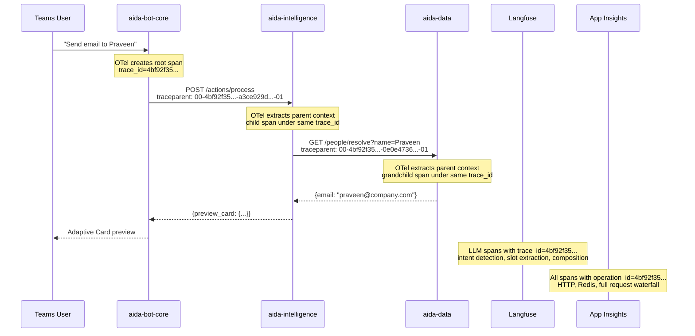

**ASCII Diagram — W3C Trace Context Propagation**

```
User         bot-core                intelligence              data               Langfuse      App Insights
 │               │                       │                       │                    │              │
 │──"Send email  │                       │                       │                    │              │
 │  to Praveen"─>│                       │                       │                    │              │
 │               │  OTel creates root span                       │                    │              │
 │               │  trace_id=4bf92f35...  │                       │                    │              │
 │               │                       │                       │                    │              │
 │               │──POST /actions/process─>                       │                    │              │
 │               │  traceparent:          │                       │                    │              │
 │               │  00-4bf92f35..-        │                       │                    │              │
 │               │  a3ce929d..-01         │                       │                    │              │
 │               │                       │  OTel extracts parent  │                    │              │
 │               │                       │  child span, same trace│                    │              │
 │               │                       │                       │                    │              │
 │               │                       │──GET /people/resolve──>│                    │              │
 │               │                       │  traceparent:          │                    │              │
 │               │                       │  00-4bf92f35..-        │                    │              │
 │               │                       │  0e0e4736..-01         │                    │              │
 │               │                       │                       │  OTel extracts      │              │
 │               │                       │                       │  grandchild span    │              │
 │               │                       │<──{praveen@co.com}───│                    │              │
 │               │<──{preview_card}──────│                       │                    │              │
 │<──Card preview│                       │                       │                    │              │
 │               │                       │                       │                    │              │
 │               │                       │                       │  LLM spans with    │              │
 │               │                       │                       │  trace_id=4bf92f──>│              │
 │               │                       │                       │                    │              │
 │               │                       │                       │  ALL spans with    │              │
 │               │                       │                       │  operation_id ─────────────────>│
 │               │                       │                       │  =4bf92f35...      │              │
```

**Correlation across systems:**

```
Trace: 4bf92f3577b34da6a3ce929d0e0e4736

├─ aida-bot-core: handle_message (root span)
│   ├─ HTTP POST aida-intelligence/actions/process
│   │   ├─ aida-intelligence: detect_intent (LLM → Langfuse)
│   │   ├─ aida-intelligence: extract_slots (LLM → Langfuse)
│   │   ├─ HTTP GET aida-data/people/resolve
│   │   │   └─ aida-data: query_cosmos (Redis+Cosmos → App Insights)
│   │   └─ aida-intelligence: compose_email (LLM → Langfuse)
│   └─ aida-bot-core: send_adaptive_card
│
├─ Langfuse: 3 LLM generations linked under trace_id
├─ App Insights: Full waterfall with operation_id, dependency map
└─ Log Analytics: All structured logs correlated by trace_id
```

### 34.4 Auto-Instrumentation Matrix

| Library | Instrumentation Package | Services | What It Captures |
|---------|------------------------|----------|------------------|
| **aiohttp server** | `opentelemetry-instrumentation-aiohttp-server` | bot-core, voice | Inbound HTTP requests, route, status, latency |
| **aiohttp client** | `opentelemetry-instrumentation-aiohttp-client` | bot-core, voice, intel | Outbound HTTP calls + auto `traceparent` injection |
| **FastAPI** | `opentelemetry-instrumentation-fastapi` | intelligence, data | Inbound REST routes, path params, status, latency |
| **httpx** | `opentelemetry-instrumentation-httpx` | intelligence | Async HTTP client spans + context propagation |
| **Redis** | `opentelemetry-instrumentation-redis` | data (primary), others via gateway | GET/SET/HSET operations, key, latency |
| **Azure SDK** | `azure-core-tracing-opentelemetry` | all | Cosmos DB, Blob Storage, Key Vault operations |

**Python packages required** (added to `aida-platform` SDK dependencies):

```
opentelemetry-api>=1.39.0
opentelemetry-sdk>=1.39.0
opentelemetry-exporter-otlp-proto-http>=1.39.0
opentelemetry-instrumentation-aiohttp-server>=0.60b1
opentelemetry-instrumentation-aiohttp-client>=0.60b1
opentelemetry-instrumentation-httpx>=0.60b1
opentelemetry-instrumentation-redis>=0.60b1
opentelemetry-instrumentation-fastapi>=0.60b1
azure-monitor-opentelemetry>=1.8.0
azure-core-tracing-opentelemetry>=1.0.0
langfuse>=3.14.0
```

### 34.5 Structured Logging with OTel Context

All services use Python's `logging` module with a JSON formatter that automatically injects OTel trace context. This allows log entries in Azure Log Analytics to be correlated with distributed traces.

```python
# aida_sdk/logging.py
import logging
import json
from opentelemetry import trace

class OTelJsonFormatter(logging.Formatter):
    """JSON log formatter with automatic OTel trace context injection."""

    def format(self, record):
        span = trace.get_current_span()
        ctx = span.get_span_context() if span else None

        log_entry = {
            "timestamp": self.formatTime(record),
            "service": record.name,
            "level": record.levelname,
            "message": record.getMessage(),
            "trace_id": format(ctx.trace_id, '032x') if ctx and ctx.trace_id else None,
            "span_id": format(ctx.span_id, '016x') if ctx and ctx.span_id else None,
        }

        # Merge extra fields (employee_id, action_type, etc.)
        if hasattr(record, "employee_id"):
            log_entry["employee_id"] = record.employee_id
        if hasattr(record, "metadata"):
            log_entry["metadata"] = record.metadata

        return json.dumps(log_entry)
```

**Example log output** (auto-correlated with OTel trace):

```json
{
  "timestamp": "2026-03-15T14:32:01.234Z",
  "service": "aida-intelligence",
  "level": "INFO",
  "message": "Email sent successfully",
  "trace_id": "4bf92f3577b34da6a3ce929d0e0e4736",
  "span_id": "a3ce929d0e0e4736",
  "employee_id": "emp-001",
  "metadata": {
    "action_type": "send_email",
    "recipient": "praveen@company.com",
    "latency_ms": 1234,
    "tokens_used": 456
  }
}
```

**Azure Log Analytics KQL query** — find all logs for a specific trace:

```kusto
traces
| where customDimensions.trace_id == "4bf92f3577b34da6a3ce929d0e0e4736"
| order by timestamp asc
| project timestamp, customDimensions.service, message, customDimensions.employee_id
```

### 34.6 Custom Spans & Business Metrics

Beyond auto-instrumentation, AIDA creates **custom spans** for business-critical operations:

```python
from opentelemetry import trace

tracer = trace.get_tracer("aida.intelligence")

async def process_meeting_end(meeting_id: str, employee_id: str):
    with tracer.start_as_current_span(
        "meeting.post_processing",
        attributes={
            "meeting.id": meeting_id,
            "employee.id": employee_id,
            "processing.type": "chunked_summarization",
        },
    ) as span:
        # Each sub-step becomes a child span
        with tracer.start_as_current_span("meeting.fetch_transcript"):
            transcript = await fetch_transcript(meeting_id)
            span.set_attribute("transcript.entries", len(transcript))

        with tracer.start_as_current_span("meeting.chunked_summarize"):
            notes = await summarize_chunks(transcript)  # LLM calls → Langfuse

        with tracer.start_as_current_span("meeting.generate_docx"):
            docx_bytes = notes.to_docx()

        with tracer.start_as_current_span("meeting.upload_sharepoint"):
            url = await upload_to_sharepoint(docx_bytes)
            span.set_attribute("sharepoint.url", url)
```

**Custom metrics** for voice quality (exported to App Insights):

| Metric | Type | Description |
|--------|------|-------------|
| `aida.voice.ttfa_ms` | Histogram | Time to first audio (user speech → AIDA response audio) |
| `aida.voice.barge_in_count` | Counter | Number of user interruptions per call |
| `aida.voice.vad_false_positive` | Counter | VAD triggers without actual speech |
| `aida.voice.session_duration_s` | Histogram | Voice call duration |
| `aida.meeting.processing_time_s` | Histogram | Post-meeting pipeline total latency |
| `aida.rag.search_latency_ms` | Histogram | Azure AI Search query latency |
| `aida.action.resolution_time_ms` | Histogram | People resolution cascade latency |

### 34.7 Resource Identity per Service

Each AIDA microservice declares its OTel resource identity via environment variables in Container Apps:

```bash
# aida-bot-core
OTEL_SERVICE_NAME=aida-bot-core
OTEL_RESOURCE_ATTRIBUTES="service.namespace=aida,service.version=0.7.5,deployment.environment=production"

# aida-voice
OTEL_SERVICE_NAME=aida-voice
OTEL_RESOURCE_ATTRIBUTES="service.namespace=aida,service.version=0.7.5,deployment.environment=production"

# aida-intelligence
OTEL_SERVICE_NAME=aida-intelligence
OTEL_RESOURCE_ATTRIBUTES="service.namespace=aida,service.version=0.7.5,deployment.environment=production"

# aida-data
OTEL_SERVICE_NAME=aida-data
OTEL_RESOURCE_ATTRIBUTES="service.namespace=aida,service.version=0.7.5,deployment.environment=production"
```

This enables **Application Map** in Azure Monitor to automatically visualize the service topology with real traffic flows and error rates between services.

### 34.8 Dashboards

| Dashboard | Platform | Audience | Data Source | Shows |
|-----------|----------|----------|-------------|-------|
| **LLM Performance** | Langfuse | Tech Lead, Devs | OTel LLM spans | Token usage, cost, latency per model/prompt |
| **Prompt Quality** | Langfuse | Tech Lead, Product | OTel LLM spans | Prompt version A/B, regression detection |
| **Employee Analytics** | Langfuse | Product, Management | OTel traces (user_id) | Per-employee usage, satisfaction, top queries |
| **Application Map** | App Insights | Tech Lead, Admin | OTel HTTP/dep spans | Service topology, error rates, latency between services |
| **Infrastructure Health** | App Insights | Tech Lead, Admin | OTel metrics + container | CPU, memory, restarts, HTTP error rates |
| **Data Gateway** | App Insights | Admin | OTel Redis/Cosmos spans | Hit rates, RU usage, pub/sub throughput |
| **Voice Quality** | App Insights | Dev A | OTel custom metrics | TTFA, barge-in latency, VAD accuracy, session duration |
| **End-to-End Trace** | App Insights | All Devs | OTel distributed traces | Full request waterfall across all 6 services |

### 34.9 Design Decisions

| Decision | Choice | Rationale |
|----------|--------|-----------|
| OTel as foundation (not direct SDK integration) | OpenTelemetry SDK | Vendor-neutral, single instrumentation for dual export, W3C standard |
| Dual-export (not OTel Collector) | In-process exporters | Simpler deployment — no sidecar container needed, ~9% latency overhead |
| LangfuseSpanProcessor filtering | Block infra scopes | Langfuse only receives LLM-relevant spans, not HTTP/Redis noise |
| Azure Monitor for infra | AzureMonitorTraceExporter | Native Azure integration, Application Map, KQL, alerts |
| `BatchSpanProcessor` (not Simple) | Async batching | Non-blocking export, ~10MB per 10K traces, 99.7%+ export success |
| W3C TraceContext propagation | Default OTel propagator | Industry standard, works across Python + Node.js services |
| JSON structured logging | Custom formatter with OTel context | Correlates logs ↔ traces in Log Analytics via `trace_id` |

---

## 35. Version Roadmap — v0.7.5, v0.7.6, v0.7.7

### v0.7.5 — OpenTelemetry + Langfuse Integration & Unified Observability

**Goal:** OpenTelemetry as the foundational telemetry layer, dual-export to Langfuse (LLM) and App Insights (infra), per-employee conversation tracking, prompt management.

| Task | Owner | Details |
|------|-------|---------|
| **OpenTelemetry SDK setup in `aida_sdk`** | Tech Lead | `setup_telemetry()` — TracerProvider, dual SpanProcessors, auto-instrumentation |
| Add OTel auto-instrumentation packages | Tech Lead | `aiohttp-server`, `aiohttp-client`, `httpx`, `redis`, `fastapi`, `azure-core-tracing` |
| Configure `AzureMonitorTraceExporter` | Tech Lead | Connection string from Key Vault, `BatchSpanProcessor` |
| Configure `LangfuseSpanProcessor` | Tech Lead | OTLP HTTP export, blocked infra scopes, LLM spans only |
| W3C TraceContext propagation across services | Tech Lead | Auto via OTel client instrumentation — validate `traceparent` headers |
| `OTelJsonFormatter` for structured logging | Tech Lead | JSON logs with `trace_id`, `span_id`, `employee_id` — exported to Log Analytics |
| `OTEL_SERVICE_NAME` per Container App | Admin | Resource identity env vars for each microservice |
| Integrate Langfuse Python SDK v3 into `aida_sdk` | Tech Lead | OTel-native `@observe()` decorator, `langfuse.get_prompt()` |
| Migrate 17+ prompts to Langfuse | Tech Lead + Dev B | Upload all `.txt` prompts, set `production` labels |
| Add `langfuse_session_id` and `langfuse_user_id` to all LLM calls | All Devs | Tag with `employee_id` and session ID |
| Custom OTel spans for business operations | Dev B | Meeting post-processing, RAG pipeline, action orchestration |
| Custom OTel metrics for voice quality | Dev A | TTFA histogram, barge-in counter, VAD false-positive counter |
| Per-employee conversation dashboard | Tech Lead | Langfuse user analytics view |
| Application Map validation | Admin | Verify service topology renders correctly in App Insights |
| Add Key Vault secrets | Admin | `langfuse-public-key`, `langfuse-secret-key`, `appinsights-connection-string` |
| Prompt A/B testing framework | Tech Lead | `staging` vs `production` label comparison |
| Cost tracking dashboard | Tech Lead | Per-employee, per-feature token/USD breakdown via Langfuse |
| End-to-end trace validation | All Devs | Verify distributed trace spans across bot-core → intelligence → data |

**Deliverables:**
- OpenTelemetry SDK initialized in all Python services with dual-export
- Every LLM call traced in Langfuse with full I/O, cost, latency
- Every HTTP/Redis/Cosmos call traced in Application Insights with dependency map
- Distributed traces correlate across all 6 microservices via W3C TraceContext
- Prompts editable in Langfuse UI without code deployment
- Structured JSON logs in Log Analytics correlated by `trace_id`
- Application Map showing real-time service topology in App Insights
- Employee analytics dashboard showing usage patterns

---

### v0.7.6 — AIDA Skills Framework

**Goal:** Package AIDA capabilities as modular, versioned skills with conditional invocation.

| Task | Owner | Details |
|------|-------|---------|
| Design Skill manifest format (SKILL.md) | Tech Lead | Name, description, version, when-to-use, procedure |
| Implement `SkillRegistry` in `aida-intelligence` | Dev B | Discovery, selection, execution, version pinning |
| Package existing capabilities as skills | Dev B | 8 skills: email-composer, meeting-booker, knowledge-search, meeting-summarizer, document-presenter, email-classifier, web-researcher, people-finder |
| Skill-aware intent detection | Dev B | GPT-4o selects skill based on manifest descriptions |
| Skill-level Langfuse tracing | Tech Lead | Each skill execution = Langfuse trace with skill metadata |
| Skill versioning linked to Langfuse prompts | Tech Lead | Skill v2.1 → Langfuse prompt `email_compose@v5` |
| Voice tool routing via skill registry | Dev A | Voice tools map to skills for consistent behavior |
| Skill development guide | Tech Lead | Documentation for adding new skills |
| OpenAI Skills API readiness layer | Tech Lead | Adapter pattern for future native Azure OpenAI Skills support |

**Deliverables:**
- 8 packaged skills with manifests
- Conditional skill invocation (not always-on)
- Per-skill prompt versioning via Langfuse
- Ready to adopt Azure OpenAI Skills API when available

---

### v0.7.7 — Modular Microservices & Data Gateway

**Goal:** Complete the monolith → microservices migration. Independent deployments, event-driven communication.

| Task | Owner | Details |
|------|-------|---------|
| Extract `aida-platform` SDK package | Tech Lead | Config, contracts, clients, data gateway client → PyPI |
| Stand up `aida-data` FastAPI service | Admin | Redis/Cosmos access, REST API, pub/sub broker |
| Data gateway client in SDK | Tech Lead | Thin HTTP wrapper matching current redis_service/cosmos_service API |
| Migrate `aida-bot-core` to use SDK + aida-data | Tech Lead | Remove direct Redis/Cosmos imports |
| Extract `aida-voice` as separate service | Dev A | Own Dockerfile, port :3979, event publishing |
| Extract `aida-intelligence` as FastAPI service | Dev B | Own Dockerfile, port :3980, event listener |
| Add `aida-screen-share` CI/CD pipeline | Dev C | Independent deployment |
| Redis pub/sub for `meeting.ended` event | Dev A + Dev B | Voice publishes, Intelligence subscribes |
| Container Apps networking (internal) | Admin | mTLS between services, aida-data sole Redis/Cosmos access |
| Schema migration framework for aida-data | Admin | Versioned migrations for Cosmos containers |
| docker-compose.dev.yml for full local stack | Tech Lead | All 5 services + Redis + Cosmos emulator |
| Load testing (inter-service latency) | All | Verify REST overhead is acceptable |

**Deliverables:**
- 6 independent repos, each with own CI/CD
- aida-data as sole gateway to Redis/Cosmos
- Event-driven post-meeting processing
- docker-compose local development stack

---

### Future (v0.8.0+)

| Enhancement | Description |
|-------------|-------------|
| **OTel Collector sidecar** | Centralized span routing, sampling, and transformation via OTel Collector — enables advanced tail-based sampling and data masking |
| **Azure Service Bus** | Replace Redis pub/sub with durable messaging (dead-letter, retry) |
| **API Gateway (APIM)** | Centralized rate limiting, auth, and routing for all services |
| **Multi-employee support** | Multiple employees per AIDA instance (multi-tenant) |
| **Native OpenAI Skills** | Adopt Azure OpenAI Skills API when available |
| **Langfuse Evaluations** | Automated quality scoring with LLM-as-judge |
| **OTel Metrics → Azure Monitor** | Export custom `MeterProvider` metrics (voice quality, RAG latency histograms) to Azure Monitor alongside traces |
| **aida-intelligence split** | Separate into meeting, email, action, document services |

---

*For the current monolithic architecture (v0.7.4), see [ARCHITECTURE.md](ARCHITECTURE.md).*
*For the modular repo strategy, see [Modular_Repo_Strategy.md](Modular_Repo_Strategy.md).*
*For the end-to-end system diagram, see [End_to_End_Solution_Architecture.md](End_to_End_Solution_Architecture.md).*
