# AIDA — End-to-End Solution Architecture

> **Version:** 0.7.4 | **Date:** February 2026 | **Author:** Solution Architecture
> **Platform:** Azure Container Apps + Azure VM | **Runtime:** Python 3.12 (async) + Node.js 20 (Puppeteer)

---

## Executive Summary

**AIDA** (AI Digital Assistant) is an **Employee Digital Twin** — an AI proxy that acts on behalf of an enterprise employee across text, voice, and live meeting modalities within Microsoft Teams. The platform combines retrieval-augmented generation (RAG), real-time voice conversation via Azure OpenAI Realtime API, live meeting intelligence with speaker-attributed transcription, and autonomous actions (email, calendar, presentations) orchestrated through Microsoft Graph. AIDA is deployed as a containerized Python service on Azure Container Apps with a companion Node.js screen-sharing microservice on an Azure VM.

---

## 1. Master End-to-End Architecture

The diagram below captures the complete system at a glance — every layer, service, and major data flow.

---

## 2. Voice Engine & Real-Time Audio Pipeline

AIDA supports two voice interaction modes: **direct voice chat** (WebSocket from Teams client) and **meeting audio** (ACS media streaming in live Teams calls). Both converge on the Azure OpenAI Realtime API for transcription and response generation.

```mermaid
graph LR
    subgraph TeamsClient["Teams Client"]
        User["👤 User Speech"]
    end

    subgraph ACSLayer["ACS Media Stream"]
        ACSWSS["ACS WebSocket<br/>PCM16 24kHz base64"]
    end

    subgraph AudioWorker["Meeting Audio Worker"]
        ManualVAD["Manual VAD<br/>(energy threshold)"]
        EchoMute["Echo Cancellation<br/>(500ms post-speech)"]
        SilenceWD["Silence Watchdog<br/>(200ms independent poll)"]
        WakeWord["Wake-Word Gate<br/>'Hey AIDA'"]
        PendingQ["Pending Response<br/>Queue"]
    end

    subgraph RealtimeAPI["Azure OpenAI Realtime API"]
        STT["Server VAD +<br/>Transcription"]
        LLM["GPT-4o-Realtime<br/>+ Function Calling"]
        TTS["TTS Output<br/>(Sage voice)"]
    end

    subgraph BargeIn["Barge-In Handler"]
        StopAudio["StopAudio<br/>→ ACS WSS"]
        ResponseCancel["response.cancel<br/>→ Realtime API"]
        ItemTruncate["item.truncate<br/>→ Realtime API"]
    end

    subgraph CTEBridge["CTE Audio Bridge"]
        ScriptProc["ScriptProcessorNode<br/>PCM16 24kHz"]
        PuppeteerBrowser["Puppeteer<br/>(Headless Chrome)"]
    end

    subgraph Output["Audio Output"]
        ACSOut["ACS WebSocket<br/>(to meeting)"]
        VoiceOut["Voice WSS<br/>(to client)"]
    end

    User -->|"Audio frames"| ACSWSS
    ACSWSS --> EchoMute
    EchoMute --> ManualVAD
    ManualVAD -->|"Speech detected"| WakeWord
    WakeWord -->|"Activated"| STT
    ManualVAD -->|"Silence >300ms"| SilenceWD
    SilenceWD -->|"Commit audio"| STT

    STT --> LLM
    LLM -->|"Text response"| TTS
    LLM -->|"Tool calls"| PendingQ
    PendingQ -->|"Tool results"| LLM

    TTS -->|"Audio delta"| ACSOut
    TTS -->|"Audio delta"| VoiceOut

    User -->|"Interrupts"| BargeIn
    StopAudio --> ACSOut
    ResponseCancel --> LLM
    ItemTruncate --> LLM

    PuppeteerBrowser -->|"Meeting audio"| ScriptProc
    ScriptProc -->|"PCM16 WSS"| EchoMute
    ACSOut -->|"AIDA speech"| ScriptProc
```

**Key Design Decisions**

| Decision | Rationale |
|----------|-----------|
| Manual VAD over server VAD | Reduces false triggers in noisy meetings; independent silence watchdog (200ms) handles edge cases |
| Zero audio conversion | ACS and Realtime API share the same format (PCM16, 24kHz, mono) — no re-encoding overhead |
| Echo mute window (500ms) | Prevents AIDA from hearing its own TTS output as new speech input |
| Wake-word gating | Multi-party meetings use "Hey AIDA" activation; 1-on-1 calls are always-active |
| CTE audio bridge | Puppeteer ScriptProcessorNode captures meeting audio at 24kHz for the screen share service |

---

## 3. RAG & Knowledge Intelligence

The RAG pipeline provides grounded, citation-backed answers from the employee's personal knowledge base with strict data isolation.

```mermaid
graph TB
    subgraph Input["User Query"]
        Query["Natural language<br/>question"]
        History["Conversation<br/>history (Redis)"]
    end

    subgraph Embedding["Embedding"]
        EmbedModel["text-embedding-<br/>3-small<br/>(1536 dimensions)"]
    end

    subgraph Search["Azure AI Search"]
        VectorSearch["Vector Search<br/>(k-NN on<br/>content_vector)"]
        BM25["BM25 Keyword<br/>Search"]
        Filter["employee_id<br/>Filter<br/>(data isolation)"]
        HybridRank["Hybrid Ranking<br/>(RRF fusion)"]
    end

    subgraph Context["Context Assembly"]
        TopK["Top-5 documents<br/>with source metadata"]
        SystemPrompt["System prompt<br/>(role, company,<br/>employee context)"]
        ConvoHistory["Last 10 turns<br/>conversation<br/>history"]
    end

    subgraph Completion["GPT-4o Completion"]
        GPT["Azure OpenAI<br/>GPT-4o<br/>(temp=0.2)"]
    end

    subgraph Output["Response"]
        Answer["Grounded answer<br/>with inline citations"]
        Sources["Source attribution<br/>(title + relevance)"]
        Card["Adaptive Card<br/>→ Teams"]
    end

    Query --> EmbedModel
    EmbedModel -->|"1536D vector"| VectorSearch
    Query -->|"Raw text"| BM25
    Filter --> VectorSearch
    Filter --> BM25
    VectorSearch --> HybridRank
    BM25 --> HybridRank
    HybridRank --> TopK
    TopK --> GPT
    History --> ConvoHistory
    ConvoHistory --> GPT
    SystemPrompt --> GPT
    GPT --> Answer
    GPT --> Sources
    Answer --> Card
    Sources --> Card
```

**Key Design Decisions**

| Decision | Rationale |
|----------|-----------|
| Hybrid search (vector + BM25) | Captures both semantic similarity and exact keyword matches for higher recall |
| `employee_id` filter | Hard data isolation — each employee only sees their own indexed documents |
| Temperature 0.2 | Low creativity for factual, grounded answers; reduces hallucination |
| Top-5 retrieval | Balances context richness with prompt token efficiency |
| Unified conversation context | Chat and voice share the same history — user can switch modality seamlessly |

---

## 4. Meeting Intelligence & Post-Processing

AIDA joins Teams meetings via ACS, captures speaker-attributed transcripts, and produces professional meeting notes as Word documents uploaded to SharePoint.

**Key Design Decisions**

| Decision | Rationale |
|----------|-----------|
| Chunked summarization (20-min chunks) | Prevents token limit issues for long meetings; preserves temporal context |
| Periodic transcript persistence | Fixes race condition where `CallDisconnected` fires before final transcript write |
| 5-second post-disconnect delay | Ensures all audio frames are processed before triggering summarization |
| Word .docx output | Professional formatting (tables, styles, colors) via `python-docx`; universally accessible |
| SharePoint over OneNote | Microsoft blocked app-only tokens for OneNote Graph endpoints (March 2025) |
| Speaker attribution | `participantRawId` from ACS audio frames mapped to display names via session roster |

---

## 5. Document Presentation & Screen Share

AIDA can find, render, and present documents via voice commands — searching SharePoint, converting to slide images, and screen-sharing into Teams meetings.

```mermaid
graph TB
    subgraph VoiceCmd["Voice Command"]
        UserCmd["'Show me the<br/>Q4 budget deck'"]
    end

    subgraph DocSearch["Document Search"]
        SPSearch["SharePoint<br/>Graph Search"]
        Download["Download file<br/>(PPTX/PDF/DOCX)"]
    end

    subgraph Rendering["Document Rendering"]
        LibreOffice["LibreOffice<br/>headless → PDF"]
        PDFRender["PDF → PNG pages<br/>(1920x1080)"]
        PreAnalysis["GPT-4o Vision<br/>pre-analysis<br/>(all slides)"]
    end

    subgraph ScreenShareSvc["Screen Share Service (Node.js VM)"]
        CTEJoin["CTE Auth →<br/>Join Teams Meeting"]
        PuppeteerCanvas["Puppeteer Canvas<br/>(slide display)"]
        GetDisplayMedia["getDisplayMedia<br/>intercept (1080p)"]
        TeamsShare["Teams Screen<br/>Share Stream"]
    end

    subgraph Navigation["Voice Navigation"]
        NavCmds["'next slide'<br/>'go to slide 3'<br/>'explain this'"]
        NavigateAPI["POST /present/<br/>navigate"]
        CanvasUpdate["Canvas re-render"]
        SessionUpdate["session.update<br/>(new slide context<br/>in instructions)"]
    end

    subgraph AudioBridgeLayer["Bidirectional Audio"]
        CaptureAudio["ScriptProcessorNode<br/>→ capture meeting audio"]
        InjectAudio["AudioContext<br/>→ inject AIDA speech"]
        WSBridge["WebSocket Bridge<br/>(PCM16 24kHz)"]
    end

    UserCmd --> SPSearch
    SPSearch -->|"File URL"| Download
    Download --> LibreOffice
    LibreOffice --> PDFRender
    PDFRender -->|"PNG base64 array"| PreAnalysis
    PreAnalysis -->|"Slide descriptions"| SessionUpdate

    PDFRender -->|"Slides payload"| PuppeteerCanvas
    CTEJoin --> PuppeteerCanvas
    PuppeteerCanvas --> GetDisplayMedia
    GetDisplayMedia --> TeamsShare

    NavCmds -->|"Voice tool call"| NavigateAPI
    NavigateAPI --> CanvasUpdate
    CanvasUpdate --> SessionUpdate

    CaptureAudio --> WSBridge
    WSBridge --> InjectAudio
    WSBridge -->|"Meeting audio<br/>→ Realtime API"| VoiceCmd
```

**Key Design Decisions**

| Decision | Rationale |
|----------|-----------|
| LibreOffice headless rendering | Server-side conversion of any Office format to PNG; no client-side dependency |
| GPT-4o Vision pre-analysis | All slides analyzed at load time, enabling instant voice explanations without per-slide API calls |
| CTE (Certified Teams Endpoint) | Only reliable way to programmatically join Teams meetings and share screen |
| `getDisplayMedia` intercept | Overrides Chromium's screen picker dialog for automated 1080p screen share |
| ScriptProcessorNode audio bridge | Bidirectional PCM16 24kHz bridge between Puppeteer browser and Python bot via WebSocket |

---

## 6. Action Orchestrator — Email, Calendar & People Resolution

AIDA detects user intent (send email, book meeting), extracts parameters via a slot-filling state machine, resolves people names, and executes through Microsoft Graph — all confirmable via Adaptive Cards.

**Key Design Decisions**

| Decision | Rationale |
|----------|-----------|
| Intent confidence threshold (0.7) | Below threshold falls through to RAG — prevents false action triggers |
| Slot-filling FSM in Redis | State persists across turns and modalities; user can start via voice, confirm via chat |
| 5-strategy people cascade | Progressively expensive lookups; instant cache hit for known contacts, GenAI fallback for ambiguity |
| Preview before execution | User always sees and confirms the action — prevents unintended emails or meetings |
| Cross-modal state | Action state keyed by `employee_id`, not conversation ID — works across chat and voice |

---

## 7. Azure Infrastructure & Security

AIDA's deployment topology spans Azure Container Apps, an Azure VM, and a suite of managed PaaS services, all secured through Entra ID and Key Vault.

**Key Design Decisions**

| Decision | Rationale |
|----------|-----------|
| Container Apps (not AKS) | Serverless scaling, lower ops burden; sufficient for single-container workload |
| Separate VM for screen share | Puppeteer + Xvfb requires a persistent virtual display; Container Apps lacks GPU/display support |
| 2 app registrations | Bot identity (Teams channel) vs. Graph identity (mail, calendar, SharePoint) — separation of privilege |
| Key Vault + Managed Identity | No secrets in environment variables or code; auto-rotation capable |
| Cosmos DB Serverless | Cost-efficient for bursty workloads (meetings are episodic, not continuous) |
| `linux/amd64` Docker builds | Required for Container Apps; Mac Silicon defaults to ARM |

---

## Technology Stack Summary

| Layer | Technology | Purpose |
|-------|-----------|---------|
| **Language** | Python 3.12 (async) | Core bot service |
| **Language** | Node.js 20 | Screen share microservice |
| **Framework** | aiohttp + Bot Framework SDK | HTTP server + Teams integration |
| **Framework** | Express + Puppeteer | REST API + headless browser |
| **LLM** | Azure OpenAI GPT-4o | Chat completion, classification, summarization |
| **Voice** | Azure OpenAI Realtime API | Bidirectional voice (STT + LLM + TTS) |
| **Embeddings** | text-embedding-3-small | 1536D vectors for RAG |
| **Search** | Azure AI Search | Hybrid vector + BM25 retrieval |
| **Calling** | ACS Call Automation v1.5 | Teams interop, media streaming |
| **Graph** | Microsoft Graph SDK | Mail, Calendar, People, SharePoint, Calling |
| **Cache** | Azure Redis Cache | Sessions, transcripts, action state |
| **Database** | Azure Cosmos DB (Serverless) | Audit logs, contacts, meeting notes |
| **Storage** | Azure Blob Storage | Generated presentations |
| **Documents** | python-pptx, python-docx, LibreOffice | Document generation and rendering |
| **Identity** | Microsoft Entra ID | OAuth2, app registrations |
| **Secrets** | Azure Key Vault + Managed Identity | Secret management |
| **Hosting** | Azure Container Apps + Azure VM | Compute |
| **Observability** | Application Insights (OpenCensus) | Telemetry, metrics, tracing |

---

## Version History

| Version | Milestone |
|---------|-----------|
| v0.1 | RAG chat, meeting summaries, PowerPoint generation |
| v0.2 | Real-time voice via Azure OpenAI Realtime API |
| v0.3 | Email send, meeting booking, people resolver |
| v0.4 | ACS calling, meeting intelligence, wake-word detection |
| v0.5.6 | Voice call context, speaker tracking, web search |
| v0.5.9 | Chunked meeting notes, MeetingNotesData model |
| v0.6.0 | Word .docx to SharePoint (replaced OneNote) |
| v0.7.0 | Document intelligence, voice-controlled presentations |
| v0.7.3 | Screen share service, CTE audio bridge |
| v0.7.4 | Manual VAD, silence watchdog, manual barge-in |

---

*For detailed implementation reference, see [ARCHITECTURE.md](ARCHITECTURE.md).*
