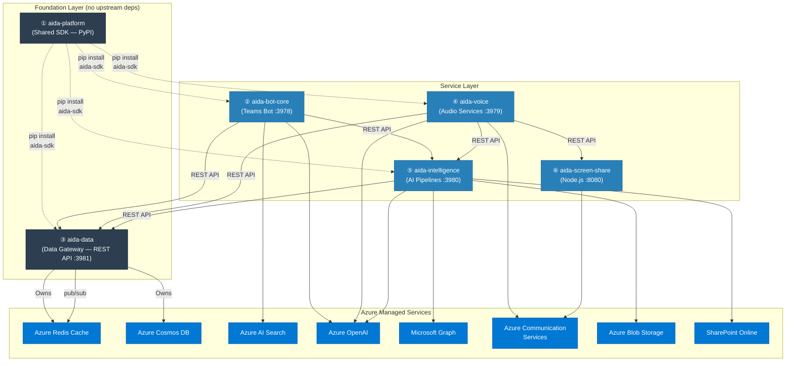
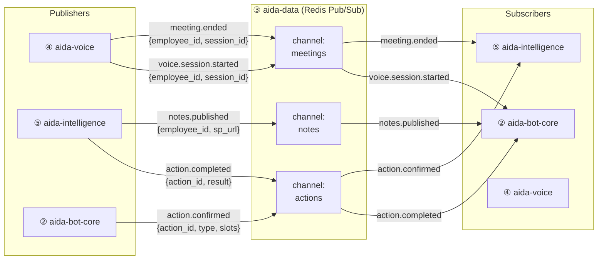
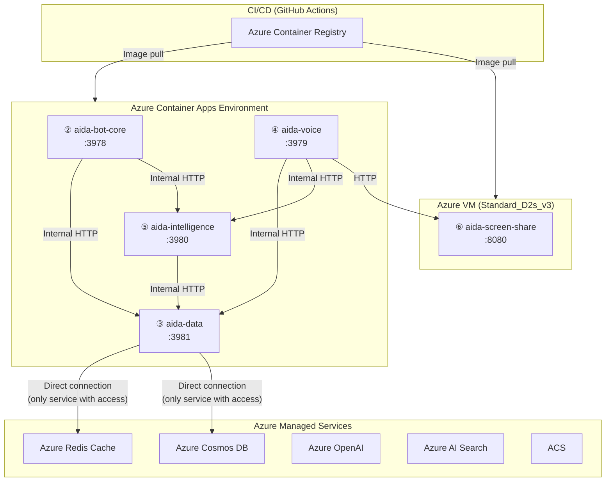
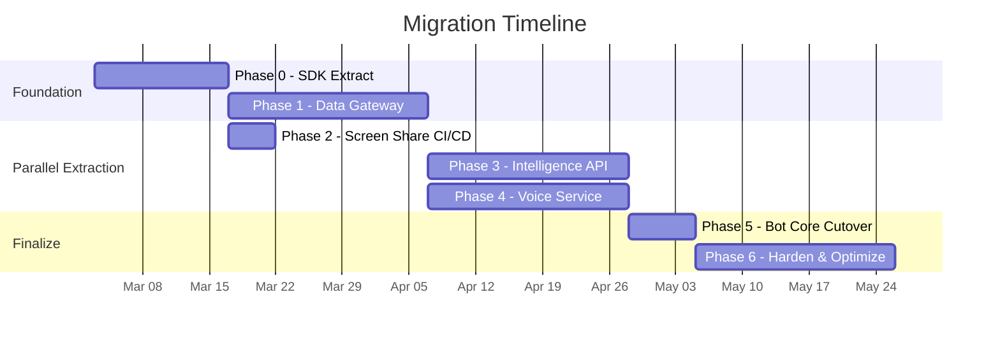

# AIDA — Modular Repository Strategy

> **Version:** 1.0 | **Date:** February 2026 | **Author:** Solution Architecture
> **Team Size:** 5 (Tech Lead + 3 Developers + 1 Admin)

---

## Executive Summary

This document defines how the AIDA monorepo splits into **6 independent repositories** with clear ownership, communication contracts, and a phased migration path. The architecture supports the current team of 5 and scales to multiple teams without re-architecture.

---

## 1. Repository Map & Team Ownership

```
┌──────────────────────────────────────────────────────────────────────┐
│                                                                      │
│   Tech Lead    ①  aida-platform       Shared SDK, contracts, CI/CD  │
│                ②  aida-bot-core       Teams bot, RAG, routing       │
│                                                                      │
│   Admin        ③  aida-data           Redis, Cosmos, schemas,       │
│                                       migrations, backup, monitoring │
│                                                                      │
│   Dev A        ④  aida-voice          Voice gateway, meeting audio, │
│                                       ACS calling, VAD, barge-in    │
│                                                                      │
│   Dev B        ⑤  aida-intelligence   Meeting notes, email, actions,│
│                                       people resolver, doc renderer │
│                                                                      │
│   Dev C        ⑥  aida-screen-share   Node.js Puppeteer presenter,  │
│                                       CTE auth, audio bridge        │
│                                                                      │
└──────────────────────────────────────────────────────────────────────┘
```

---

## 2. Dependency Graph



**Key rule:** Only `aida-data` talks to Redis and Cosmos directly. All other repos go through `aida-data`'s REST API (or the thin SDK client in `aida-platform`).

---

## 3. Repo Details

### ① `aida-platform` — Shared SDK (Tech Lead)

The foundation package that every Python repo installs. Contains **contracts** (data models), **service clients** (OpenAI, Graph, AI Search), and the **data gateway client** (thin HTTP wrapper for `aida-data`).

```
aida-platform/
├── aida_sdk/
│   ├── __init__.py
│   ├── config.py                  # Settings (Pydantic BaseSettings) — single source of truth
│   │
│   ├── contracts/                 # Shared data models (Pydantic v2)
│   │   ├── __init__.py
│   │   ├── conversation.py        # ConversationContext, Modality, SessionMapping
│   │   ├── meeting.py             # MeetingSession, MeetingState, MeetingNotesData
│   │   ├── action.py              # ActionState, SlotDefinitions, ResolvedPerson
│   │   ├── document.py            # DocumentContext, SlideAnalysis
│   │   ├── email.py               # EmailClassification, EmailAction
│   │   └── events.py              # Event schemas for pub/sub
│   │
│   ├── clients/                   # External service clients (stateless, config-driven)
│   │   ├── openai_client.py       # GPT-4o + embeddings + Realtime API
│   │   ├── graph_client.py        # Mail, calendar, people, SharePoint
│   │   ├── search_client.py       # Azure AI Search (hybrid vector+BM25)
│   │   ├── acs_client.py          # ACS Call Automation
│   │   ├── speech_client.py       # Azure Speech (TTS fallback)
│   │   ├── web_search_client.py   # DuckDuckGo
│   │   └── telemetry_client.py    # Application Insights
│   │
│   ├── data_gateway/              # Thin HTTP client for aida-data REST API
│   │   ├── __init__.py
│   │   ├── redis_ops.py           # get/set/pub/sub via aida-data API
│   │   ├── cosmos_ops.py          # CRUD via aida-data API
│   │   └── conversation_manager.py # Unified context (calls data gateway internally)
│   │
│   └── utils/
│       ├── json_escape.py         # Adaptive Card JSON escaping
│       └── time_helpers.py
│
├── tests/
├── pyproject.toml                 # pip install aida-sdk
└── .github/workflows/
    └── publish.yml                # Build + publish to private PyPI on tag
```

**What moved here:**
- `bot_service/config.py` → `aida_sdk/config.py`
- All dataclasses from `conversation_manager.py`, `meeting_state.py`, `action_orchestrator.py`, `meeting_notes.py` → `aida_sdk/contracts/`
- `orchestrator/services/openai_service.py`, `graph_service.py`, `search_service.py`, `acs_service.py`, etc. → `aida_sdk/clients/`
- `conversation_manager.py` → `aida_sdk/data_gateway/conversation_manager.py` (rewired to call `aida-data` API instead of Redis directly)

**What stays out:** No business logic. No prompts. No handlers. Pure SDK.

---

### ② `aida-bot-core` — Teams Bot & RAG (Tech Lead)

The front door. Receives Teams messages, routes commands, runs the RAG pipeline, renders Adaptive Cards.

```
aida-bot-core/
├── bot_service/
│   ├── __init__.py
│   ├── app.py                     # aiohttp server :3978, route registration
│   ├── bot.py                     # AidaBot ActivityHandler (command routing)
│   ├── handlers/
│   │   ├── chat_handler.py        # Free text → RAG → Adaptive Card
│   │   ├── action_handler.py      # Card submit → calls aida-intelligence API
│   │   ├── ppt_handler.py         # /ppt → calls aida-intelligence API
│   │   ├── email_handler.py       # /email → calls aida-intelligence API
│   │   ├── meeting_handler.py     # /join, /leave → calls aida-voice API
│   │   └── help_handler.py
│   ├── cards/                     # Adaptive Card JSON templates
│   └── webhooks/
│       └── mail_webhook.py        # Graph mail push → calls aida-intelligence API
├── orchestrator/
│   └── rag_pipeline.py            # Embed → search → GPT-4o → response
├── Dockerfile
├── requirements.txt               # aida-sdk + botbuilder-core + aiohttp
└── .github/workflows/
    └── deploy.yml
```

**Inter-repo communication:**

| Calls | Target | Method |
|---|---|---|
| Chat text → action check | `aida-intelligence` | `POST /api/actions/detect-intent` |
| Card confirm/edit/cancel | `aida-intelligence` | `POST /api/actions/execute` |
| /ppt generation | `aida-intelligence` | `POST /api/documents/generate-ppt` |
| /email processing | `aida-intelligence` | `POST /api/email/classify` |
| /join meeting | `aida-voice` | `POST /api/meeting/join` |
| Conversation history | `aida-data` | via `aida_sdk.data_gateway` |
| RAG search | Azure AI Search | via `aida_sdk.clients.search_client` |
| RAG completion | Azure OpenAI | via `aida_sdk.clients.openai_client` |

---

### ③ `aida-data` — Data Gateway (Admin)

**The single owner of Redis and Cosmos DB.** Exposes a REST API for all data operations. Owns schemas, migrations, TTL policies, backup, monitoring, and data integrity.

```
aida-data/
├── data_service/
│   ├── __init__.py
│   ├── app.py                     # FastAPI server :3981
│   │
│   ├── api/                       # REST endpoints
│   │   ├── redis_api.py           # /redis/* — session, conversation, pub/sub
│   │   ├── cosmos_api.py          # /cosmos/* — CRUD for all containers
│   │   ├── conversation_api.py    # /conversations/* — unified context ops
│   │   ├── meeting_api.py         # /meetings/* — meeting state + transcript
│   │   ├── contacts_api.py        # /contacts/* — known contacts registry
│   │   └── health.py              # /health — Redis + Cosmos connectivity check
│   │
│   ├── store/                     # Data access layer (only place that touches DB)
│   │   ├── redis_store.py         # Redis connection pool, all key operations
│   │   ├── cosmos_store.py        # Cosmos client, container management
│   │   └── pubsub.py             # Redis pub/sub broker
│   │
│   ├── schemas/                   # Canonical data schemas (JSON Schema / Pydantic)
│   │   ├── conversation.py        # conv:{id} — message format, TTL rules
│   │   ├── session.py             # session:{id} — session data format
│   │   ├── meeting_state.py       # meeting:{emp}:{sid} — meeting lifecycle
│   │   ├── meeting_transcript.py  # meeting-transcript:{sid} — transcript entries
│   │   ├── action_state.py        # action:{emp} — slot-filling state
│   │   ├── people_cache.py        # people:{key} — resolution cache
│   │   └── teams_ref.py           # teams-ref:{emp} — proactive msg reference
│   │
│   ├── migrations/                # Schema evolution scripts
│   │   ├── 001_initial_cosmos_containers.py
│   │   ├── 002_add_meeting_intelligence.py
│   │   ├── 003_add_known_contacts.py
│   │   └── migrate.py            # Migration runner
│   │
│   ├── maintenance/               # Admin tools
│   │   ├── backup_cosmos.py       # Scheduled Cosmos backup/export
│   │   ├── redis_cleanup.py       # Orphaned key cleanup
│   │   ├── ttl_audit.py           # Verify TTL policies are applied
│   │   └── data_stats.py         # Dashboard: key counts, container sizes
│   │
│   └── monitoring/
│       ├── redis_metrics.py       # Memory, hit rate, connected clients
│       └── cosmos_metrics.py      # RU consumption, partition balance
│
├── Dockerfile
├── requirements.txt               # aida-sdk + fastapi + azure-cosmos + redis
├── docker-compose.dev.yml         # Local Redis + Cosmos emulator for dev
└── .github/workflows/
    ├── deploy.yml
    └── migration.yml              # Run migrations on merge to main
```

**REST API Surface:**

```
# ─── Redis Operations ───────────────────────────────────
GET    /redis/session/{session_id}
PUT    /redis/session/{session_id}               # body: {data, ttl}
DELETE /redis/session/{session_id}

# ─── Conversation (Unified Context) ─────────────────────
GET    /conversations/{employee_id}/history      # ?max_turns=10
POST   /conversations/{employee_id}/append       # body: {role, content, modality}
GET    /conversations/{employee_id}/context       # full ConversationContext
POST   /conversations/map-session                # body: {external_id, employee_id}

# ─── Meeting State ───────────────────────────────────────
GET    /meetings/{employee_id}/{session_id}/state
PUT    /meetings/{employee_id}/{session_id}/state  # body: MeetingSession
POST   /meetings/{employee_id}/{session_id}/transcript/append  # body: TranscriptEntry
GET    /meetings/{employee_id}/{session_id}/transcript
DELETE /meetings/{employee_id}/{session_id}       # cleanup after processing

# ─── Action State (Slot-filling FSM) ────────────────────
GET    /actions/{employee_id}/state
PUT    /actions/{employee_id}/state               # body: ActionState
DELETE /actions/{employee_id}/state

# ─── People / Contacts ──────────────────────────────────
GET    /contacts/{employee_id}                    # known contacts list
POST   /contacts/{employee_id}                    # save resolved contact
GET    /contacts/{employee_id}/resolve-cache/{name}
PUT    /contacts/{employee_id}/resolve-cache/{name}

# ─── Cosmos CRUD (Generic) ──────────────────────────────
POST   /cosmos/{container}/items                  # create
GET    /cosmos/{container}/items/{id}             # read (query: partitionKey)
PUT    /cosmos/{container}/items/{id}             # upsert
POST   /cosmos/{container}/query                  # body: {query, parameters}

# ─── Cosmos Domain Shortcuts ─────────────────────────────
POST   /cosmos/meeting-notes                      # save_meeting_notes
POST   /cosmos/conversations                      # save_conversation audit
POST   /cosmos/email-responses                    # save_email_log
POST   /cosmos/email-actions                      # save_email_action
POST   /cosmos/meeting-actions                    # save_meeting_action
GET    /cosmos/meeting-intelligence/{employee_id}  # query meeting notes

# ─── Events (Pub/Sub) ───────────────────────────────────
POST   /events/publish                            # body: {channel, event_type, payload}
WS     /events/subscribe/{channel}                # WebSocket stream of events

# ─── Admin / Monitoring ─────────────────────────────────
GET    /health                                    # Redis + Cosmos connectivity
GET    /admin/redis/stats                         # Memory, key counts
GET    /admin/cosmos/stats                        # RU usage, container sizes
POST   /admin/migrations/run                      # Trigger pending migrations
```

**Redis Key Registry (Admin owns the schema):**

| Key Pattern | TTL | Owner (Writer) | Consumers (Readers) |
|---|---|---|---|
| `conv:{canonical_id}` | 30 min | bot-core, voice | bot-core, voice, intelligence |
| `session:{session_id}` | 30 min | voice | voice, bot-core |
| `sesmap:{external_id}` | 1 hour | bot-core, voice | bot-core, voice |
| `voice-active:{employee_id}` | 4 hours | voice | bot-core |
| `action:{employee_id}` | 30 min | intelligence | bot-core, voice, intelligence |
| `people:{employee_id}:{name}` | 1 hour | intelligence | intelligence |
| `meeting:{employee_id}:{session_id}` | 4 hours | voice | voice, intelligence |
| `meeting-transcript:{session_id}` | 4 hours | voice | intelligence |
| `teams-ref:{employee_id}` | 24 hours | bot-core | bot-core, intelligence |
| `contacts:{employee_id}` | 24 hours | intelligence | intelligence |
| `resolve:{employee_id}:{name}` | 1 hour | intelligence | intelligence |

**Cosmos Container Registry:**

| Container | Partition Key | Primary Writer | Primary Reader |
|---|---|---|---|
| `conversations` | `employee_id` | bot-core (audit) | bot-core |
| `meeting-notes` | `employee_id` | intelligence | intelligence, voice |
| `meeting-intelligence` | `employee_id` | intelligence | intelligence, voice |
| `email-responses` | `employee_id` | intelligence | intelligence |
| `email-actions` | `employee_id` | intelligence | intelligence |
| `meeting-actions` | `employee_id` | intelligence | intelligence |
| `known-contacts` | `employee_id` | intelligence | intelligence |

---

### ④ `aida-voice` — Voice & Calling (Dev A)

Everything real-time audio: voice WebSocket gateway, meeting audio worker with manual VAD, ACS calling, wake-word detection.

```
aida-voice/
├── voice_service/
│   ├── __init__.py
│   ├── app.py                     # aiohttp server :3979
│   ├── voice_gateway.py           # /voice-v2 WebSocket proxy → Realtime API
│   ├── meeting_audio_worker.py    # ACS ↔ Realtime API bridge
│   ├── voice_tools.py             # Tool definitions + execution
│   ├── voice_state.py             # VoiceSession, VoiceState
│   ├── meeting_state.py           # MeetingSession lifecycle
│   ├── meeting_wake_word.py       # "Hey AIDA" detection
│   └── webhooks/
│       ├── acs_webhook.py         # ACS CallConnected/Disconnected
│       └── calling_webhook.py     # Graph incoming call notification
├── Dockerfile
├── requirements.txt               # aida-sdk + aiohttp + azure-communication-*
└── .github/workflows/
    └── deploy.yml
```

**Inter-repo communication:**

| Calls | Target | Method |
|---|---|---|
| Conversation history | `aida-data` | via `aida_sdk.data_gateway` |
| Transcript persistence | `aida-data` | `POST /meetings/.../transcript/append` |
| Meeting state | `aida-data` | `PUT /meetings/.../state` |
| Post-meeting trigger | `aida-data` | `POST /events/publish` → `meeting.ended` |
| Tool: search_knowledge_base | `aida-bot-core` | `POST /api/rag/query` (or direct AI Search) |
| Tool: send_email | `aida-intelligence` | `POST /api/actions/execute` |
| Tool: navigate_slide | `aida-screen-share` | `POST /present/navigate` |
| Audio to Realtime API | Azure OpenAI | via `aida_sdk.clients.openai_client` |
| ACS media stream | ACS | Direct WebSocket |

---

### ⑤ `aida-intelligence` — AI Pipelines (Dev B)

All non-real-time AI pipelines: meeting summarization, email classification, action orchestrator, people resolver, document intelligence.

```
aida-intelligence/
├── intelligence_service/
│   ├── __init__.py
│   ├── app.py                     # FastAPI server :3980
│   │
│   ├── api/                       # REST endpoints
│   │   ├── actions.py             # /actions/detect-intent, /actions/fill-slots, /actions/execute
│   │   ├── meetings.py            # /meetings/summarize, /meetings/process-end
│   │   ├── email.py               # /email/classify, /email/respond
│   │   ├── documents.py           # /documents/render, /documents/analyze, /documents/generate-ppt
│   │   └── people.py              # /people/resolve
│   │
│   ├── orchestrator/              # Business logic (moved from monorepo orchestrator/)
│   │   ├── action_orchestrator.py
│   │   ├── people_resolver.py
│   │   ├── email_classifier.py
│   │   ├── email_responder.py
│   │   ├── meeting_intelligence.py
│   │   ├── meeting_post_processor.py
│   │   ├── meeting_notes.py
│   │   ├── meeting_summarizer.py
│   │   ├── document_intelligence.py
│   │   ├── document_renderer.py
│   │   ├── ppt_generator.py
│   │   └── prompts/               # All GPT prompt templates (.txt)
│   │
│   └── workers/
│       └── event_listener.py      # Subscribes: meeting.ended → auto-process
│                                  # Subscribes: notes.requested → generate on demand
├── Dockerfile                     # Includes LibreOffice for doc rendering
├── requirements.txt               # aida-sdk + fastapi + python-docx + python-pptx
└── .github/workflows/
    └── deploy.yml
```

**Inter-repo communication:**

| Calls | Target | Method |
|---|---|---|
| Read/write action state | `aida-data` | `GET/PUT /actions/{employee_id}/state` |
| Save meeting notes | `aida-data` | `POST /cosmos/meeting-intelligence` |
| Resolve contacts | `aida-data` | `GET /contacts/{employee_id}/resolve-cache/{name}` |
| Listen for meeting.ended | `aida-data` | `WS /events/subscribe/meetings` |
| Publish notes.published | `aida-data` | `POST /events/publish` |
| GPT-4o completion | Azure OpenAI | via `aida_sdk.clients.openai_client` |
| Send mail / create event | Microsoft Graph | via `aida_sdk.clients.graph_client` |
| Upload .docx | SharePoint | via `aida_sdk.clients.graph_client` |

---

### ⑥ `aida-screen-share` — Presenter Service (Dev C)

Already a separate Node.js microservice. Minimal changes — add proper CI/CD and API docs.

```
aida-screen-share/
├── src/
│   ├── index.js                   # Express :8080
│   ├── presenter.js               # Puppeteer + canvas slide rendering
│   ├── presenter.html             # Slide display UI
│   ├── audio-bridge.html          # ScriptProcessorNode (PCM16 24kHz)
│   ├── call-manager.js            # Session lifecycle
│   └── cte-auth.js               # CTE Teams authentication
├── Dockerfile                     # Chromium + Xvfb + PulseAudio
├── package.json
└── .github/workflows/
    └── deploy.yml
```

**Communication:** REST API only (no SDK dependency) — called by `aida-voice` and `aida-intelligence`.

---

## 4. Event-Driven Communication

Services communicate asynchronously via events published through `aida-data`'s pub/sub broker.



**Event Schema (defined in `aida_sdk/contracts/events.py`):**

```python
class AidaEvent(BaseModel):
    event_type: str          # "meeting.ended", "notes.published", etc.
    timestamp: datetime
    employee_id: str
    source_service: str      # "aida-voice", "aida-intelligence", etc.
    payload: dict            # Event-specific data
    correlation_id: str      # For distributed tracing
```

**Future scale:** Swap Redis pub/sub → Azure Service Bus (durable queues, dead-letter, retry policies) with zero code changes in service repos (only `aida-data` broker implementation changes).

---

## 5. Deployment Topology



**Key principle:** Only `aida-data` has network access to Redis and Cosmos. Other containers route through `aida-data`'s internal endpoint. This is enforced via Container Apps environment networking rules.

---

## 6. Migration Phases

| Phase | What | Who | Duration | Risk |
|---|---|---|---|---|
| **Phase 0** | Extract `aida-platform` SDK — move config, contracts, service clients to PyPI package. Monorepo still works, imports from SDK. | Tech Lead | 1-2 weeks | Low |
| **Phase 1** | Stand up `aida-data` — wrap existing `redis_service.py` + `cosmos_service.py` in FastAPI. Add `data_gateway` client to SDK. Run both old (direct) and new (via API) paths in parallel. | Admin | 2-3 weeks | Low |
| **Phase 2** | Extract `aida-screen-share` — already separate, just add CI/CD pipeline and API docs. | Dev C | 3-5 days | None |
| **Phase 3** | Extract `aida-intelligence` — move orchestrator modules, expose REST API. Bot-core calls intelligence API instead of direct imports. | Dev B | 2-3 weeks | Medium |
| **Phase 4** | Extract `aida-voice` — move voice gateway + meeting audio worker. Add event publishing for `meeting.ended`. | Dev A | 2-3 weeks | Medium |
| **Phase 5** | Cut over `aida-bot-core` — remove all direct orchestrator imports, rely entirely on SDK + REST APIs. Delete monorepo. | Tech Lead | 1 week | Low |
| **Phase 6** | Harden — API gateway (APIM/Traefik), Service Bus upgrade, shared observability dashboard, load testing. | All | 2-3 weeks | Low |

**Total estimated timeline:** 10-14 weeks (parallel work across team after Phase 0).

### Phase Dependency Chart



---

## 7. Scaling to Multiple Teams

The 6-repo structure supports growth without re-architecture:

```
Current (5 people)          Future (3+ teams)
──────────────────          ──────────────────────────────────
① aida-platform    →  ① aida-platform (Platform Team)
② aida-bot-core    →  ② aida-bot-core (Bot Team)
③ aida-data        →  ③ aida-data (Data/Infra Team)
④ aida-voice       →  ④ aida-voice (Voice Team)
⑤ aida-intelligence → ⑤a aida-meeting-intelligence (Meeting Team)
                       ⑤b aida-email-service (Email Team)
                       ⑤c aida-action-service (Actions Team)
                       ⑤d aida-document-service (Document Team)
⑥ aida-screen-share → ⑥ aida-screen-share (Presentation Team)
```

`aida-intelligence` has 4 clean domain boundaries inside it (meetings, email, actions, documents) — each can become its own repo when team size justifies it.

---

## 8. Governance Rules

| Rule | Rationale |
|---|---|
| **All data access goes through `aida-data`** | Single point of schema governance; Admin controls migrations, TTLs, backup |
| **All shared types live in `aida-platform`** | No duplicate dataclasses; version-locked contracts via semver |
| **Services communicate via REST + events only** | No direct Python imports across repo boundaries |
| **Each repo has its own Dockerfile + CI/CD** | Independent deployment; no monorepo build bottleneck |
| **SDK version pinned in each repo** | `aida-sdk>=0.3.0,<0.4.0` — breaking changes require major version bump |
| **Tech Lead approves `aida-platform` PRs** | Contract changes affect all repos; must be backward-compatible |
| **Admin approves `aida-data` schema changes** | Schema migrations must be reviewed for backward compatibility |
| **Feature branches per repo, trunk-based for SDK** | SDK stays stable; feature work happens in service repos |

---

## 9. Local Development

Each developer can run the full stack locally using a shared `docker-compose`:

```yaml
# docker-compose.dev.yml (lives in aida-platform or a separate devtools repo)
services:
  redis:
    image: redis:7-alpine
    ports: ["6379:6379"]

  cosmos-emulator:
    image: mcr.microsoft.com/cosmosdb/linux/azure-cosmos-emulator:latest
    ports: ["8081:8081"]

  aida-data:
    build: ../aida-data
    ports: ["3981:3981"]
    depends_on: [redis, cosmos-emulator]
    env_file: .env.dev

  aida-bot-core:
    build: ../aida-bot-core
    ports: ["3978:3978"]
    depends_on: [aida-data]
    env_file: .env.dev

  aida-voice:
    build: ../aida-voice
    ports: ["3979:3979"]
    depends_on: [aida-data]
    env_file: .env.dev

  aida-intelligence:
    build: ../aida-intelligence
    ports: ["3980:3980"]
    depends_on: [aida-data]
    env_file: .env.dev
```

Developers can also run just their own service + `aida-data` + Redis (stub other services with mocks from the SDK).

---

*For the current monolithic architecture reference, see [ARCHITECTURE.md](ARCHITECTURE.md).*
*For the end-to-end system diagram, see [End_to_End_Solution_Architecture.md](End_to_End_Solution_Architecture.md).*
